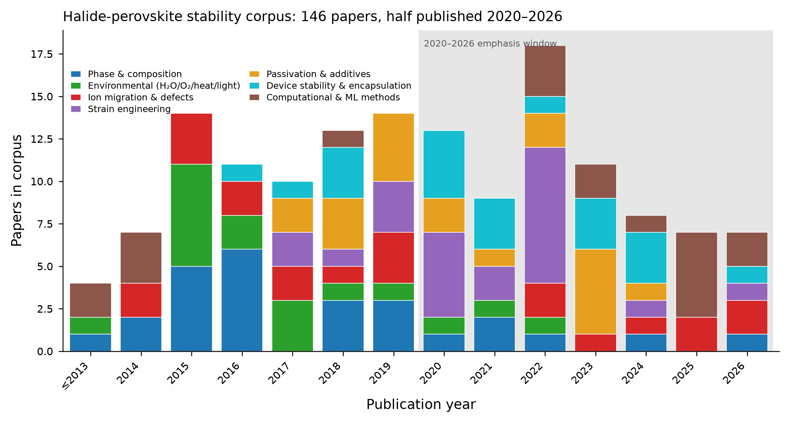
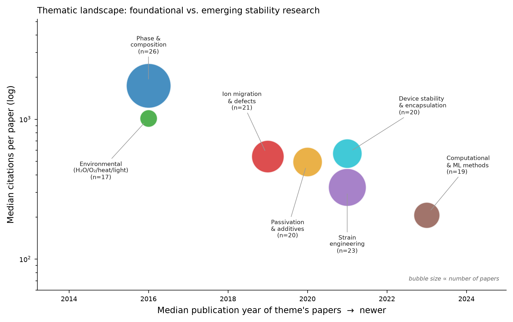

# Stability of Halide Perovskite Solar Cells: A Panorama Review

*A synthesis of 146 primary and review papers (2000–2026, half published since 2020) across seven stability channels — phase and compositional stability, environmental degradation, ion migration, strain, passivation and additives, device operational stability, and the computational methods that increasingly underpin all six.*

---

## 1. Introduction: the intrinsic-instability paradox

Metal halide perovskites (ABX₃; A = MA⁺, FA⁺, Cs⁺; B = Pb²⁺; X = I⁻, Br⁻) have reached certified single-junction efficiencies above 27%, yet operational instability remains the decisive barrier between the laboratory and the marketplace. The instability is not an incidental defect of immature processing; it is rooted in the same physics that makes the material an excellent absorber. A soft, strongly ionic, low-formation-energy lattice grants perovskites their long carrier lifetimes, defect tolerance, and solution processability — and simultaneously permits facile ion migration, low-barrier phase transitions, and ready chemical attack by moisture, oxygen, and heat. The favourable and unfavourable properties are two faces of one lattice, so instability cannot be eliminated, only suppressed to an engineering-acceptable level. This review maps how the field has learned to do that suppression, and where the map still has blank regions.

The stabilisation problem resolves into seven coupled channels, and the value of surveying them together is that their coupling, not their separateness, is where the current research frontier lies. **Phase and compositional stability** (§3.1) concerns whether the photoactive black phase survives at all against photoinactive polymorphs, a thermodynamic contest tuned by the Goldschmidt tolerance factor and by A-site and halide mixing. **Environmental degradation** (§3.2) covers the extrinsic attack of moisture, oxygen, heat, and ultraviolet light: the channels that encapsulation can, in principle, exclude. **Ion migration** (§3.3) is the channel that encapsulation cannot exclude, because a device migrates ions merely by operating under its own built-in field — it is the mechanistic hub linking hysteresis, halide segregation, interfacial accumulation, and electrode corrosion, and it is the specific target of the computational programme this review supports. **Strain engineering** (§3.4) treats residual lattice strain as an intrinsic degradation lever that modulates both phase stability and migration barriers. **Passivation and additives** (§3.5) is the dominant practical toolkit, acting on the undercoordinated defects that seed most other channels. **Device operational stability** (§3.6) is where all intrinsic and extrinsic channels are finally weighed together under standardised illumination-and-bias protocols. And **computational and machine-learning methods** (§3.7) increasingly supply the predictive, mechanism-resolved understanding that the experimental channels cannot reach one candidate at a time.

The organising insight that recurs across all seven channels is that **ion migration occupies a privileged causal position**. Transition-state theory places the migration activation energy $E_a$ in the exponent of the hop rate, so that at room temperature a shift of only ~0.2 eV changes the migration rate by three orders of magnitude—no other single materials parameter offers comparable leverage over operational stability. Migration is also the shared substrate of channels that are superficially distinct: photoinduced halide segregation is vacancy-mediated migration under illumination, hysteresis is migration on the sub-second timescale, interfacial corrosion is migration on the thousand-hour timescale, and both strain and passivation ultimately earn their stability benefit by raising migration barriers or removing the vacancies that carry the current. This is why a computational programme aimed at *pinning* mobile iodide (raising $E_a$ by rational choice of A-site cations and interstitial dopants) sits at the centre of the stability enterprise rather than at its periphery.

## 2. Scope and construction of the corpus

This survey was assembled by systematic retrieval from the OpenAlex scholarly graph and arXiv, seeded with the anchor literature of an active ion-migration screening programme and expanded one step in each direction along the citation graph (backward through reference lists, forward through citing works) on the most-cited paper in every theme. The resulting corpus of 146 unique papers spans 2000–2026, with half published in the 2020–2026 emphasis window and the remainder reaching back to the field-defining work of the mid-2010s and the foundational method papers before it. Coverage is deliberately broad rather than exhaustive: each theme carries on the order of twenty primary papers chosen for centrality and citation impact, and thirteen papers recur across more than one theme — the connective tissue of the field, and a useful cross-check that the thematic partition reflects real coupling rather than an arbitrary filing scheme.

Two figures summarise the corpus. The publication timeline (Fig. 1) shows the field's growth and the shifting thematic composition of stability research year by year; the thematic landscape (Fig. 2) plots each theme by the median publication year and median citation impact of its papers, with bubble area proportional to paper count, separating the foundational, heavily-cited pillars (phase stability, environmental degradation) from the emerging fronts (computational methods, strain engineering) where citations are still accruing. A master reference table accompanies the review as a CSV, with every paper's authors, year, venue, DOI, citation count, and thematic assignment.

*Figure 1. Publication-year distribution of the 146-paper corpus, stacked by primary theme. Pre-2013 foundational work (method papers, early perovskite reports) is folded into the leftmost bin. The shaded region marks the 2020–2026 emphasis window, which contains half of the corpus.*

*Figure 2. Each theme positioned by the median publication year (x) and median citations-per-paper (y, log scale) of its papers; bubble area is proportional to the number of papers. Foundational, heavily-cited themes (phase, environmental) sit upper-left; newer, still-accruing themes (computational/ML, strain) sit lower-right. Citation counts reflect OpenAlex at time of retrieval and are inherently age-biased — recent work has had less time to accrue citations.*

---

## 3. The seven stability channels

### 3.1 Phase and compositional stability

The central bottleneck in halide-perovskite stability is thermodynamic: the photoactive corner-sharing "black" perovskite phase is, for the two compositions most relevant to single-junction photovoltaics — FAPbI₃ and CsPbI₃, only metastable at operating temperatures, and relaxes toward wide-gap, photoinactive non-perovskite polymorphs (hexagonal δ-FAPbI₃; orthorhombic δ-CsPbI₃) unless it is held in place by composition, dimensionality, strain, or kinetic trapping. The field's dominant response has been compositional: alloying the A-site (Cs/FA/MA/Rb) and the halide (I/Br) to push a structure whose geometric tolerance factor sits at the edge of the perovskite-forming window back toward its centre, while simultaneously exploiting configurational entropy and secondary-phase pinning to raise the free-energy barrier against demixing. This section synthesises what determines black-phase stability, how far compositional and low-dimensional engineering can extend it, and where the remaining trade-offs, most acutely the bandgap-versus-segregation tension in mixed halides, still bound device design.

#### Geometric predictors: tolerance and octahedral factors

The starting point for rationalising which ABX₃ halides form stable perovskites, and which sit precariously at the boundary, remains the Goldschmidt tolerance factor supplemented by the octahedral factor. Early formability mapping across the ABX₃ (X = F, Cl, Br, I) halide family established that neither factor alone is sufficient: the perovskite-forming region is bounded in a two-dimensional tolerance-factor/octahedral-factor plane, so a composition can fail either by an A-cation too large or too small, or by a B–X octahedron that cannot tile [Li et al. 2008](https://doi.org/10.1107/s0108768108032734). This geometric picture directly explains the FAPbI₃/CsPbI₃ dilemma: FA⁺ sits near the upper tolerance-factor edge and Cs⁺ near the lower edge, so that FA–Cs alloying tunes an effective tolerance factor back toward the stable interior of the window [Li et al. 2015](https://doi.org/10.1021/acs.chemmater.5b04107). Because the classical factor was parameterised on oxides, halide-specific recalibration was needed; a revised tolerance-factor system for inorganic and hybrid halides materially improved the discrimination of perovskite from non-perovskite structures [Travis et al. 2016](https://doi.org/10.1039/c5sc04845a). The most quantitatively rigorous update replaced the single ratio with a data-derived one-parameter descriptor τ that classifies 576 ABX₃ solids at roughly 92% accuracy, outperforming the Goldschmidt t and providing a transferable screen for candidate compositions [Bartel et al. 2019](https://doi.org/10.1126/sciadv.aav0693). For the present programme, these descriptors set the coarse-grained expectation (which compositions are even worth stabilising) against which dopant- and defect-level barrier engineering then operates.

#### Stabilising the black phase of FAPbI₃

FAPbI₃ has the near-ideal bandgap for a single-junction absorber but the most stubborn phase problem, and the literature traces a clear progression from recognising the instability to kinetically and thermodynamically defeating it. The composition was introduced as a broadly tunable trihalide precisely because its ~1.48 eV gap outperforms MAPbI₃, but the same work flagged its spontaneous room-temperature conversion to the yellow hexagonal δ-phase [Eperon et al. 2014](https://doi.org/10.1039/c3ee43822h). The first generation of solutions was crystallisation control: methylammonium chloride was shown to template oriented, phase-pure α-FAPbI₃ through a transient intermediate phase rather than by remaining in the lattice [Kim et al. 2019](https://doi.org/10.1016/j.joule.2019.06.014), and additive-assisted growth (MDACl₂) stabilised phase-pure α-FAPbI₃ at a near-ideal gap without resorting to Br or Cs bandgap widening, decoupling phase stability from the composition-driven gap penalty [Min et al. 2019](https://doi.org/10.1126/science.aay7044). The benchmark demonstration that black-phase FAPbI₃ could be both stabilised and defect-passivated came from pseudo-halide (formate) anion engineering, which delivered certified efficiencies above 25% while suppressing the deep traps that accompany α-phase films [Jeong et al. 2021](https://doi.org/10.1038/s41586-021-03406-5). The frontier has since moved toward eliminating the yellow-phase pathway altogether: recent work reports crystallisation routes that bypass the δ-phase intermediate to give extremely stable formamidinium cells [Garai et al. 2026](https://doi.org/10.1126/science.aeb7992). Taken together, these studies show FAPbI₃ black-phase stability is governed less by equilibrium thermodynamics alone than by controlling the crystallisation trajectory and the defect population that nucleates the reverse transition — precisely the regime where atomistic simulation of migration and pinning is most informative.

#### Inorganic CsPbI₃ and the role of nanocrystal size

For all-inorganic CsPbI₃, removing the volatile organic cation improves thermal robustness but sharpens the phase problem, because the black polymorphs are even more strongly metastable relative to the yellow δ-phase at room temperature. The first inorganic CsPbI₃ cells demonstrated the concept but documented a facile black-to-yellow transition on exposure to ambient conditions [Eperon et al. 2015](https://doi.org/10.1039/c5ta06398a). A conceptually distinct stabilisation lever emerged from colloidal chemistry: reducing the crystallite to the nanoscale so that surface energy shifts the phase balance, allowing cubic α-CsPbI₃ quantum-dot films to persist at room temperature and deliver efficient photovoltaics [Swarnkar et al. 2016](https://doi.org/10.1126/science.aag2700). The microscopic origin of the black polymorphs' behaviour was clarified by first-principles and scattering studies showing that strong anharmonic octahedral tilting, rather than a simple harmonic instability, underlies the interconversion and metastability of the α/β/γ-CsPbI₃ phases [Marronnier et al. 2018](https://doi.org/10.1021/acsnano.8b00267). This directly connects phase retention to octahedral distortion. Pressure-directed tilting was subsequently used to lock in a robust black CsPbI₃ phase, establishing lattice compression and strain as a handle on polymorph selection [Ke et al. 2021](https://doi.org/10.1038/s41467-020-20745-5). The γ→δ transition in CsPbI₃ is the specific system this programme targets — and the anharmonic-tilting picture is the structural context in which iodide-vacancy migration and dopant pinning should be interpreted.

#### A-site cation mixing and configurational entropy

The single most productive stabilisation strategy has been A-site alloying, and the field's understanding evolved from empirical bandgap optimisation to an explicit thermodynamic rationale rooted in configurational entropy. Compositional FA–MA engineering was first used to co-optimise bandgap and crystallinity, establishing mixed A-site cations as the route to simultaneously high and stable efficiency [Jeon et al. 2015](https://doi.org/10.1038/nature14133). The thermodynamic argument was made explicit shortly after: mixing multiple A-cations was framed as entropic stabilisation, in which the configurational entropy of the disordered cation sublattice lowers the free energy of the perovskite phase and raises the barrier to demixing into competing phases [Yi et al. 2015](https://doi.org/10.1039/c5ee03255e). This principle was operationalised in the triple-cation Cs/MA/FA absorber, which proved markedly more reproducible, thermally stable and phase-robust than double-cation baselines and became the de facto workhorse composition [Saliba et al. 2016a](https://doi.org/10.1039/c5ee03874j); extending the alloy to a quadruple-cation Rb/Cs/MA/FA system further suppressed yellow-phase impurities and improved operational stability [Saliba et al. 2016b](https://doi.org/10.1126/science.aah5557). The trajectory since has been to remove the least stable constituent while retaining the entropic benefit: MA-free Cs/FA compositions eliminate the most thermally labile cation without sacrificing efficiency [Turren-Cruz et al. 2018](https://doi.org/10.1126/science.aat3583). A complementary, non-entropic route is secondary-phase pinning, in which a deliberately inactive (PbI₂)₂RbCl phase mechanically stabilises the photoactive lattice and yields efficient, stable devices [Zhao et al. 2022](https://doi.org/10.1126/science.abp8873) — a strategy conceptually adjacent to the dopant-pinning approach at the heart of this programme.

#### Mixed-halide alloying and the bandgap–segregation trade-off

Halide alloying is indispensable for bandgap tuning — especially for the wide-gap top cells of tandems, but it introduces the field's sharpest stability trade-off: light-induced halide segregation. The foundational observation was reversible photoinduced trap formation in mixed I/Br films, the Hoke effect, in which illumination drives phase separation into I-rich (low-gap) and Br-rich domains that pin the emission and open-circuit voltage to the low-gap phase [Hoke et al. 2014](https://doi.org/10.1039/c4sc03141e). Cation engineering partially resolves this: incorporating FA and Cs into a mixed-halide absorber both widens the gap to the tandem-relevant range and, through entropic mixing, suppresses the halide segregation and thermal instability that afflict MA-based mixed halides [McMeekin et al. 2016](https://doi.org/10.1126/science.aad5845). The most effective mitigation to date is triple-halide (Cl-alloyed) engineering, which suppresses photoinduced segregation and stabilises ~1.67 eV wide-gap absorbers under sustained illumination [Xu et al. 2020](https://doi.org/10.1126/science.aaz5074). The residual tension, that the compositions with the most useful bandgaps are the most prone to demixing, and that segregation is itself mediated by mobile halide vacancies, makes the coupling between compositional phase stability and ion migration explicit, and is a direct motivation for suppressing vacancy transport.

#### Low-dimensional and 2D/3D approaches to phase stabilisation

Reducing dimensionality provides an orthogonal stabilisation axis, trading some charge transport for substantially improved phase and environmental robustness. High-efficiency two-dimensional Ruddlesden–Popper cells demonstrated that bulky spacer cations confer markedly better moisture and phase stability than 3D analogues, at the cost of anisotropic transport that device architecture must accommodate [Tsai et al. 2016](https://doi.org/10.1038/nature18306). Rather than using 2D phases as the absorber, the more widely adopted strategy uses them as a structural template or capping layer: a thin 2D perovskite layer was shown to template and stabilise phase-pure 3D formamidinium perovskite, explicitly bridging 2D engineering with α-phase retention [Lee et al. 2018](https://doi.org/10.1038/s41467-018-05454-4). This template concept has matured into durable device architectures in which epitaxially matched 2D layers lock the underlying 3D black phase in place under operational stress, yielding both efficiency and long-term stability [Sidhik et al. 2024](https://doi.org/10.1126/science.abq6993). The 2D/3D approach thus acts partly by phase templating and partly by surface strain, again pointing to interfacial strain and defect chemistry as the operative variables.

#### Synthesis and outlook

Across these sub-themes a consistent picture emerges: black-phase stability is set by a small free-energy margin over non-perovskite polymorphs, and every successful strategy either raises that margin (entropic A-site mixing, tolerance-factor centring, nanocrystal surface energy, secondary-phase pinning) or kinetically suppresses the transition pathway (crystallisation control, 2D templating, strain-locked octahedral tilting). Two threads bear directly on ion-migration-suppressing dopant design. First, the reverse transition to the yellow phase is nucleated and mediated by point defects, vacancies in particular, so that phase stability and defect/ion-migration control are not separable problems but two views of the same lattice. The intrinsic thermal lability of MAPbI₃ below 85 °C that motivated the whole compositional programme [Conings et al. 2015](https://doi.org/10.1002/aenm.201500477) is itself defect- and cation-mediated. Second, the most durable compositions (MA-free Cs/FA, triple-halide, 2D-capped) are precisely those in which mobile-ion populations are curtailed, reinforcing the thesis that pinning iodide vacancies in γ-CsPbI₃ should stabilise both the transport behaviour and the phase itself. The open frontier lies in bypassing the δ-phase pathway entirely and quantifying the entropy/strain contributions to the black-phase free energy from first principles — exactly where the DFT/NEB/MLIP approach of this programme is positioned to contribute.

### 3.2 Environmental degradation: moisture, oxygen, heat, light

The extrinsic instability of halide perovskites is not a single failure mode but a set of chemically distinct, mutually reinforcing degradation channels: hydrolysis by water, photo-oxidation by molecular oxygen, thermal decomposition with volatile-cation loss, ultraviolet-driven photocatalysis at the electron-selective contact, and light-driven halide redistribution. Each has a resolved mechanism, and each is accelerated by the others. The consensus that emerged over 2015–2022 is that moisture and oxygen attack is overwhelmingly *defect- and light-mediated* rather than a simple chemical reaction with a pristine lattice, that the archetypal methylammonium (MA) lead iodide composition is intrinsically thermally unstable independent of any atmosphere, and that the most damaging real-world stress is the *combination* of illumination with a reactive small molecule (O₂ or H₂O) — because early stability claims were made under wildly inconsistent test conditions, the field has since converged on standardized ISOS reporting protocols so that moisture, thermal, and light stressors are applied and documented reproducibly [Khenkin et al. 2020](https://doi.org/10.1038/s41560-019-0529-5). The subsections below treat each channel and then their synergy and compositional mitigation.

#### Moisture ingress and hydrate-phase intermediates

Water attacks MAPbI₃ through a reversible hydration sequence that only becomes destructive on prolonged exposure, which reframes "moisture instability" as a kinetically staged process rather than instantaneous decomposition. In situ diffraction and spectroscopy establish that humid air first intercalates water to form a crystalline monohydrate (CH₃NH₃PbI₃·H₂O) and then a dihydrate ((CH₃NH₃)₄PbI₆·2H₂O), and that this hydration is reversible upon drying until enough water accumulates to drive irreversible segregation into PbI₂ [Leguy et al. 2015](https://doi.org/10.1021/acs.chemmater.5b00660). Real-time imaging of single films resolves the humidity dependence of this conversion and confirms PbI₂ as the terminal solid product, quantifying how degradation rate scales with relative humidity [Yang et al. 2015](https://doi.org/10.1021/nn506864k). The reversibility of the early stage is counterintuitively useful: controlled exposure to humidified air can transiently *improve* device performance before the same water intercalation, sustained, degrades it — evidence that the initial water-perovskite interaction is a defect-healing/complexation step distinct from hydrolytic breakdown [Christians et al. 2015](https://doi.org/10.1021/ja511132a). Microstructure sets where and how fast this proceeds: moisture-induced degradation nucleates preferentially at grain boundaries, and the overall rate scales with grain-boundary density, identifying grain enlargement and boundary passivation as direct moisture-stability levers [Wang et al. 2016](https://doi.org/10.1039/c6ee02941h).

#### Photo-oxidation and the superoxide channel

Molecular oxygen degrades MAPbI₃ not by direct oxidation but through a photochemical superoxide route seeded by halide vacancies, making photo-oxidation a defect-controlled channel rather than an intrinsic material property. The foundational mechanism is that photogenerated electrons reduce adsorbed O₂ to superoxide (O₂⁻), which deprotonates the methylammonium cation and collapses the lattice to PbI₂, H₂O, and volatile products—a process requiring the simultaneous presence of light and O₂ [Aristidou et al. 2015](https://doi.org/10.1002/anie.201503153). The rate-limiting factor is defect density: iodide vacancies both accelerate O₂ diffusion into the film and provide the sites at which superoxide forms, so films with more iodide vacancies photo-oxidize faster, directly coupling point-defect chemistry to environmental durability [Aristidou et al. 2017](https://doi.org/10.1038/ncomms15218). At the device level, this channel rather than moisture is often the operational bottleneck. Exposure to light and oxygen, even in the nominal absence of water, limits the operational stability of unencapsulated MAPbI₃ cells, establishing photo-oxidation as a first-order engineering constraint [Bryant et al. 2016](https://doi.org/10.1039/c6ee00409a). More recent mechanistic work shows the channels are not additive but synergistic: trace water markedly accelerates the photo-oxidation of MAPbI₃, so light + O₂ + H₂O together degrade the material faster than any pairwise combination [Siegler et al. 2022](https://doi.org/10.1021/jacs.2c00391).

#### Thermal decomposition and organic-cation volatilization

MAPbI₃ carries an intrinsic thermal instability that is independent of moisture and oxygen, which places a hard ceiling on the durability achievable with the MA cation regardless of encapsulation quality. Calorimetric and diffraction measurements under inert atmosphere show MAPbI₃ decomposing near the ~85 °C damp-heat test temperature even when water and oxygen are rigorously excluded, so thermal breakdown is a property of the compound rather than an environmental reaction [Conings et al. 2015](https://doi.org/10.1002/aenm.201500477). Resolving the products disentangles two superficially similar routes: mass-spectrometric analysis of the evolved gases distinguishes thermal decomposition (releasing CH₃NH₂ and HI) from photochemical decomposition (favoring NH₃ and CH₃I), giving a diagnostic fingerprint for which stressor dominated a given failure [Juárez-Pérez et al. 2018](https://doi.org/10.1039/c8ta03501f). Formamidinium (FA), often invoked as the thermally robust successor to MA, is not immune: FA-based perovskites decompose on heating into sym-triazine and other volatile species (including HCN), demonstrating that cation-volatilization pathways persist for FA and must be designed against rather than assumed away [Juárez-Pérez et al. 2019](https://doi.org/10.1039/c9ta06058h).

#### UV-induced degradation and TiO₂ photocatalysis

A large fraction of early "UV instability" was traced not to the absorber but to the electron-selective contact, redirecting mitigation toward the charge-transport stack rather than the perovskite itself. Ultraviolet illumination of the mesoporous TiO₂ electron-transport layer triggers photocatalytic reactions at the TiO₂/perovskite interface, driven by UV-generated holes and oxygen desorption from surface trap sites, that degrade the device; insulating or replacing TiO₂ with UV-inert oxides largely suppresses this loss, showing the instability is contact-derived and engineerable [Leijtens et al. 2013](https://doi.org/10.1038/ncomms3885). This finding motivated the broad migration to SnO₂ and other wide-gap, less photocatalytically active electron-transport layers in stable device architectures.

#### Photoinduced halide segregation as a light-driven channel

In mixed-halide perovskites, light itself drives a reversible compositional instability called halide segregation, which caps the usable open-circuit voltage of wide-gap absorbers and therefore behaves as a genuine light-stability channel, one that couples to ion migration. The archetype is the "Hoke effect": under illumination, mixed I/Br perovskites reversibly phase-separate into iodide-rich (low-bandgap) and bromide-rich domains, and the low-gap domains funnel carriers so that photoluminescence red-shifts and the effective voltage is pinned below the alloy bandgap; the effect reverses in the dark [Hoke et al. 2014](https://doi.org/10.1039/c4sc03141e). Mechanistically, the community has advanced complementary models: a polaron/strain picture in which photogenerated carriers locally distort the lattice and thermodynamically favor iodide-rich domains, accounting for the reversibility [Bischak et al. 2017](https://doi.org/10.1021/acs.nanolett.6b04453); a carrier-density-driven thermodynamic model that quantitatively reproduces the illumination-intensity threshold and composition dependence of segregation [Draguta et al. 2017](https://doi.org/10.1038/s41467-017-00284-2); and more recently, evidence that halide *oxidation* (iodide to I₂/I₃⁻) is a chemical initiator of the demixing, embedding redox chemistry in what was long treated as a purely physical migration problem [Kerner et al. 2021](https://doi.org/10.1016/j.joule.2021.07.011). Because segregation is mediated by mobile halide vacancies, it is the point at which the extrinsic light-stability story hands off to the ion-migration channel treated elsewhere in this survey — the practical countermeasure is compositional. Incorporating chloride into wide-gap I/Br perovskites suppresses photoinduced segregation and enables operationally stable ~1.67–1.68 eV top cells for tandems [Xu et al. 2020](https://doi.org/10.1126/science.aaz5074).

#### Synergy, compositional mitigation, and standardized reporting

The unifying lesson across these channels is that halide-perovskite degradation is dominated by *coupled* stressors and *defect-mediated* chemistry, so durability is won by attacking defects and composition simultaneously rather than by blocking any single agent. Superoxide formation requires both light and O₂ and is gated by iodide vacancies [Aristidou et al. 2017](https://doi.org/10.1038/ncomms15218); water accelerates that photo-oxidation [Siegler et al. 2022](https://doi.org/10.1021/jacs.2c00391); and light drives halide demixing that is itself partly a halide-oxidation reaction [Kerner et al. 2021](https://doi.org/10.1016/j.joule.2021.07.011). This web of interactions places vacancies and mobile halides as the common thread linking this track to the ion-migration and defect track. On the composition axis, replacing the volatile, hydrolysis- and photo-oxidation-prone MA cation with FA/Cs mixtures yields intrinsically more photo- and moisture-stable absorbers [Lee et al. 2015](https://doi.org/10.1002/aenm.201501310), while engineering the charge-transport contacts (UV-inert electron layers and stabilizing metal-oxide interfaces) markedly improves ambient stability at the device level [You et al. 2015](https://doi.org/10.1038/nnano.2015.230). Finally, because the field's early stability literature was fractured by non-comparable test conditions, the community-authored ISOS consensus protocols now standardize how moisture, thermal, light-soaking, and operational stressors are applied and reported — making cross-study comparison of extrinsic stability meaningful for the first time [Khenkin et al. 2020](https://doi.org/10.1038/s41560-019-0529-5).

### 3.3 Ion migration and point defects

**Bottom line.** Halide perovskites are mixed electronic–ionic conductors whose defining stability liability is the field mobility of their own constituent ions. Across DFT, climbing-image NEB and, increasingly, machine-learned interatomic potentials (MLIPs), a consistent picture has emerged: the singly-charged iodide vacancy is the lowest-barrier migrating species, with activation energies clustering in the 0.1–0.6 eV range, and its motion is the microscopic origin of current–voltage hysteresis, light-induced halide segregation, interfacial ion accumulation and electrode corrosion. The design corollary that motivates this programme is equally consistent: barriers can be raised by A-site cation choice and by multivalent interstitial dopants that immobilise the mobile sub-lattice, with ions thereby "pinned" to the crystal structure. What remains contested is the origin of the order-of-magnitude scatter in reported barriers, which recent multiscale and MLIP work attributes less to the intrinsic bulk crystal than to microstructure, charge state and measurement protocol.

#### Vacancy-mediated iodide migration is the lowest-energy transport channel

The mechanistic foundation is that iodide moves by hopping into adjacent iodide vacancies, and that this pathway carries a lower barrier than migration of the A-site cation or lead. The seminal DFT-plus-impedance study of Eames and co-workers established iodide-vacancy migration in MAPbI3 with an activation energy near 0.6 eV and framed the perovskite as a photovoltaic that is simultaneously a solid electrolyte ([Eames et al. 2015](https://doi.org/10.1038/ncomms8497)). Contemporaneous first-principles work reached the same ordering of mobilities independently: Azpiroz and colleagues computed iodide as the most mobile species and explicitly connected its motion to the anomalous device behaviour then puzzling the field ([Azpiroz et al. 2015](https://doi.org/10.1039/c5ee01265a)), while Haruyama and co-workers mapped the concerted vacancy-mediated pathways and confirmed the anion as the lowest-barrier migrant ([Haruyama et al. 2015](https://doi.org/10.1021/jacs.5b03615)). The convergence of three independent 2015 calculations on iodide-vacancy hopping despite differences in functional, cell size, and barrier method means this channel is now treated as the default transport mechanism — and why the present programme centres its NEB campaign on the iodide vacancy in γ-CsPbI3 rather than on cation or interstitial pathways.

#### Point-defect chemistry and the origin of defect tolerance

The reason perovskites tolerate high native-defect densities while still migrating ions is that the dominant intrinsic defects are shallow and self-compensating, leaving a mobile but electronically benign vacancy population. Walsh and co-workers articulated the self-regulation mechanism by which charged point defects form in compensating pairs that pin the Fermi level and keep most native defects shallow, providing the thermodynamic basis for defect tolerance ([Walsh et al. 2014](https://doi.org/10.1002/anie.201409740)). Meggiolaro and Angelis sharpened this into a chemical-potential argument, showing that iodine-rich versus iodine-poor growth conditions determine whether deep or shallow states dominate and thereby control both tolerance and the reservoir of migrating iodide ([Meggiolaro et al. 2018](https://doi.org/10.1039/c8ee00124c)). For the inorganic system of direct relevance here, Huang and Lambrecht enumerated the intrinsic point defects of CsPbI3 and their charge states, identifying which vacancies and interstitials are thermodynamically accessible and how their transition levels sit within the gap ([Huang et al. 2017](https://doi.org/10.1021/acs.jpcc.7b10045)). Together these establish the defect inventory and the charge-state assignments that any per-charge-state MLIP treatment of migration in CsPbI3 must reproduce.

#### Hysteresis is the short-timescale fingerprint of mobile ions

Current–voltage hysteresis was the first macroscopic symptom to be traced to ion migration, and its timescale (sub-second to seconds) directly reflects ionic redistribution under bias. Snaith and co-workers first documented the anomalous, scan-rate-dependent hysteresis of perovskite cells and flagged slow ionic or defect processes as a leading cause ([Snaith et al. 2014](https://doi.org/10.1021/jz500113x)). The interpretation was consolidated by Yuan and Huang, whose review assembled the evidence that mobile ions produce hysteresis, switchable photovoltaic response and giant low-frequency dielectric constants, unifying a set of otherwise disparate observations under a single ionic mechanism ([Yuan et al. 2016](https://doi.org/10.1021/acs.accounts.5b00420)). The practical value of hysteresis is quantitative: because its magnitude and time constants scale with the density and mobility of migrating species, transient-response methods convert a nuisance artefact into a measurement of the ion population, a point exploited by the drift techniques discussed next.

#### Quantification exposes a wide and microstructure-dependent barrier scatter

Direct measurement of migrating-ion densities and barriers reveals that reported activation energies span nearly the full 0.1–0.6 eV window, and reconciling this scatter is now a central problem. Transient ion-drift measurements by Futscher and co-workers resolved distinct migrating species with separable activation energies and densities, showing that more than one mobile defect operates simultaneously and that cation and anion contributions can be disentangled kinetically ([Futscher et al. 2019](https://doi.org/10.1039/c9mh00445a)). The resolution to why single-crystal barriers, thin-film barriers and device-level barriers disagree came from Ghasemi and co-workers, whose multiscale diffusion framework demonstrated that grain size and morphology, not the intrinsic bulk crystal barrier, set the effective diffusivity, explaining the order-of-magnitude spread across the literature ([Ghasemi et al. 2023](https://doi.org/10.1038/s41563-023-01488-2)). This directly cautions that a computed single-crystal NEB barrier is a lower bound on, not a prediction of, device-relevant transport — and that dopant rankings should be interpreted as relative shifts rather than absolute device barriers.

#### Grain boundaries carry migration faster than the bulk

A recurring theme is that polycrystalline films migrate ions predominantly along grain boundaries, where the barrier is lower and the pathway more continuous than through grain interiors. Shao and co-workers imaged this directly, showing grain-boundary-dominated ion migration in MAPbI3 films and linking boundary passivation to suppressed migration and hysteresis ([Shao et al. 2016](https://doi.org/10.1039/c6ee00413j)). Atomistically, grain boundaries have only recently become tractable because they demand cells and timescales beyond routine DFT — the gap that MLIPs now fill (below). The bulk-versus-boundary distinction matters for the present work because a defect-engineering strategy validated on the perfect γ-CsPbI3 crystal must ultimately contend with boundaries as the fast-transport short-circuit, and because the apparent barrier a device reports is a boundary-weighted average rather than the bulk NEB value.

#### Halide segregation is a migration-driven compositional instability

In mixed-halide perovskites, ion migration expresses itself as reversible photo-induced phase segregation, which caps the usable bandgap for tandem applications. Hoke and co-workers discovered the effect: reversible light-induced formation of iodide-rich, low-gap domains in mixed I/Br films, now termed the Hoke effect ([Hoke et al. 2014](https://doi.org/10.1039/c4sc03141e)). Zhang and co-workers demonstrated that the same segregation occurs in all-inorganic CsPb(I/Br)3 and tied it explicitly to halide-vacancy migration, ruling out organic-cation-specific explanations and implicating the anion sub-lattice directly ([Zhang et al. 2019](https://doi.org/10.1038/s41467-019-09047-7)). Because segregation is driven by the same vacancy-hopping process this programme targets, suppressing iodide-vacancy mobility should mitigate segregation as a side benefit — a testable prediction of the pinning-dopant hypothesis.

#### Long-timescale migration drives accumulation, drift and electrode corrosion

Beyond seconds-scale hysteresis, sustained ion migration causes irreversible interfacial ion accumulation, stoichiometric drift, and ultimately chemical attack on contacts. Domanski and co-workers separated fast, reversible performance losses from slow, cation-migration-induced degradation accumulating over hours of operation, establishing that ionic redistribution has both a recoverable and a cumulative component ([Domanski et al. 2017](https://doi.org/10.1039/c6ee03352k)). The endpoint of unchecked migration (halide reaching and corroding metal electrodes, and the associated stoichiometric drift) motivates immobilisation not merely as a hysteresis fix but as a durability requirement, since a migrating halide inventory that reaches a silver or gold contact converts a reversible artefact into permanent chemical loss.

#### Pinning cations and interstitial immobilisation raise the barrier

The central design principle for this programme is that migration barriers are not fixed material constants but can be raised by composition and doping. On the A-site, Lee and co-workers reframed the cation as a migration-barrier lever, showing that appropriately chosen (notably larger, hydrogen-bonding) cations raise the iodide-migration barrier and stabilise operation. This "pinning" concept names the project's candidate class ([Lee et al. 2022](https://doi.org/10.1126/science.abj1186)). Complementarily, Zhao and co-workers demonstrated that multivalent interstitial cations immobilise mobile halides, raising the effective migration barrier and suppressing transport without disrupting the photovoltaic lattice ([Zhao et al. 2022](https://doi.org/10.1038/s41563-022-01390-3)). Earlier, Li and co-workers showed that chemical-bond-enhanced cation and anion immobilisation suppresses migration and extends operational lifetime, establishing immobilisation as a general and effective route ([Li et al. 2019](https://doi.org/10.1038/s41560-019-0382-6)). These three papers define the two mechanistic families: A-site substitution and interstitial pinning — families that a Δ*E*a ranking of ~50 dopants is designed to screen and prioritise.

#### MLIPs make charge-state-resolved migration at realistic scale tractable

The methodological frontier and computational spine of this programme is the use of machine-learned interatomic potentials to compute migration at length- and timescales that DFT cannot reach while retaining near-DFT accuracy and charge-state resolution. Samatov and co-workers trained a machine-learning force field to resolve ion migration at perovskite grain boundaries, capturing the boundary-accelerated transport that motivated the bulk-versus-boundary distinction above ([Samatov et al. 2024](https://doi.org/10.1021/acs.jpclett.4c03332)). Tyagi and co-workers used a machine-learned force field to trace migration trajectories and barrier distributions across charge states, moving beyond single-barrier NEB to the statistical distribution of hopping events ([Tyagi et al. 2025](https://doi.org/10.1021/acs.jpclett.5c01139)), and their unified follow-up treats cation and anion migration in MAPbI3 within one force field, closing the gap between anion-only and full-inventory descriptions ([Tyagi et al. 2026, preprint](https://doi.org/10.48550/arXiv.2605.02685)). Most directly, Arber, Mocanu and Islam applied MLIP-driven NEB to quantify dopant effects on iodide-vacancy migration in γ-CsPbI3: the exact system, method and charge-state-resolved strategy this programme extends to a ~50-dopant screen ([Arber et al. 2025](https://doi.org/10.1021/acs.chemmater.5c00503)). A current synthesis of mechanisms, measurement and mitigation is provided by Thiesbrummel and co-workers — whose review situates these MLIP advances within the broader ion-migration literature and frames suppression as the operative stability challenge ([Thiesbrummel et al. 2026](https://doi.org/10.1038/s41570-025-00790-8)). The through-line is that per-charge-state fine-tuned MLIPs now make it feasible to rank pinning dopants by their computed Δ*E*a, the deliverable this survey underpins.

### 3.4 Strain and lattice engineering

**Bottom line.** Residual lattice strain is now recognised as an *intrinsic* degradation channel in halide-perovskite photovoltaics — one that, unlike moisture or heat ingress, cannot be defeated by encapsulation and must instead be engineered out of the film itself. The consensus that has crystallised over 2020–2026 is directional and mechanistically specific: **tensile** strain elongates and weakens Pb–X bonds, lowers defect-formation energies, and depresses the activation energy for both ion migration and halide segregation, whereas converting the film to a **mild compressive** state raises those same barriers and stabilises the photoactive phase. Strain engineering has consequently migrated from a curiosity to a front-line stability strategy, most decisively at the buried charge-transport-layer interface and under the operational stressors (day/night cycling, reverse bias) that dominate real-world failure.

#### Origins of residual strain

The foundational insight is that a perovskite film is rarely in its relaxed equilibrium state after fabrication. [Zhao et al. 2017](https://doi.org/10.1126/sciadv.aao5616) established that solution-processed MAPbI₃ films are residually strained relative to their substrates because the perovskite and substrate contract by different amounts on cooling from the annealing temperature. This thermal-expansion-coefficient mismatch locks in tensile strain and measurably degrades the intrinsic stability of the lattice. This thermal-mismatch mechanism is compounded by compositional inhomogeneity: [Zhu et al. 2019](https://doi.org/10.1038/s41467-019-08507-4) used depth-dependent grazing-incidence X-ray diffraction to map a *gradient* of in-plane residual strain through the film thickness, arising from local composition separation and lattice mismatch in mixed-halide absorbers, and showed via first-principles calculations that the resulting strain bends the energy bands and reshapes carrier dynamics. A third, operando source is photoinduced: [Tsai et al. 2018](https://doi.org/10.1126/science.aap8671) demonstrated that light soaking produces a reversible lattice expansion of order tenths of a percent that relaxes local strain at grain boundaries and interfaces and, counterintuitively, improves efficiency uniformly across device architectures. Together these three origins (thermal-mismatch, solvent/composition, and photoinduced expansion) frame residual strain as unavoidable in conventionally processed films and set the agenda for the reviews that followed ([Moloney et al. 2020](https://doi.org/10.1021/acsmaterialslett.0c00308); [Wu et al. 2021](https://doi.org/10.1093/nsr/nwab047)).

#### From tensile strain to defects, non-radiative loss and migration

The mechanistic core of the field is the link between the *sign* of strain and the energetics of degradation. Tensile strain stretches the metal–halide framework, lowering the formation energy of halide vacancies and reducing the barrier a mobile iodide must overcome—precisely the quantity a dopant-pinning programme seeks to raise. [Jones et al. 2019](https://doi.org/10.1039/c8ee02751j) provided the direct optoelectronic consequence, imaging strain patterns across films and correlating regions of higher local strain with shortened carrier lifetimes, thereby tying lattice strain to non-radiative recombination. [Zhu et al. 2019](https://doi.org/10.1038/s41467-019-08507-4) closed the loop to device performance, using controlled strain modulation to recover a 20.7% certified efficiency and demonstrating that strain is an engineerable variable rather than merely a defect signature. The [Chemical Society Reviews synthesis of Yang et al. 2022](https://doi.org/10.1039/d2cs00278g) and the *Nature Materials* analysis of [Liu et al. 2021](https://doi.org/10.1038/s41563-021-01097-x) codified this causal chain (strain → weakened bonds → lower defect-formation and migration energies → accelerated ion transport and recombination) as the field's governing framework, and [Meng et al. 2022](https://doi.org/10.1016/j.joule.2022.01.011) resolved the microscopic mechanisms connecting lattice distortion to defect populations and transport in operating cells. This is the point of direct contact with a DFT/NEB dopant-ranking programme: the same tensile distortion that these papers correlate with faster macroscopic migration is what lowers the computed vacancy-hop barrier, so strain state is a confound that must be controlled when attributing a ΔEₐ to a pinning dopant.

#### Compressive strain, migration barriers and halide segregation

The corollary — that *compressive* strain should raise the barriers that tensile strain lowers, has been demonstrated cleanly enough to serve as a design principle. [Muscarella et al. 2020](https://doi.org/10.1021/acsenergylett.0c01474) applied hydrostatic pressure to compress the lattice and showed directly that lattice compression *increases the activation barrier for photoinduced halide segregation* in mixed-halide films, isolating strain (as opposed to composition or defect chemistry) as the controlling variable for phase separation. The companion study [Muscarella & Ehrler 2022](https://doi.org/10.1016/j.joule.2022.07.005) generalised this into a strain–phase-stability relationship, mapping how the applied strain state shifts both the thermodynamics and kinetics of halide demixing. The device-level realisation came from [Xue et al. 2020](https://doi.org/10.1038/s41467-020-15338-1), who injected an *external compressive strain from a high-thermal-expansion hole-transport layer* to compensate the residual tensile strain left by annealing; they measured the resulting increase in ion-migration activation energy and delivered a wide-bandgap (>1.75 eV) cell that retained 96% of its initial efficiency after 1000 h at 85 °C, at the time the most stable wide-gap perovskite reported. That mixed-halide, wide-gap compositions are simultaneously the most segregation-prone and the most strain-responsive makes this the sub-theme where strain and compositional stability are inextricable ([Zhang et al. 2022, Angew. Chem.](https://doi.org/10.1002/anie.202212268)).

#### Strain–phase-stability coupling

Strain also governs the black-versus-yellow polymorph competition that defines the phase stability of the most efficient absorbers. [Kim et al. 2020](https://doi.org/10.1126/science.abc4417) showed that relaxing residual strain in α-formamidinium lead iodide suppresses its transition to the photoinactive δ-phase, stabilising the perovskite polymorph and improving performance; this represents the strain analogue of the compositional and interfacial phase-stabilisation strategies covered elsewhere in this survey. [Chen et al. 2020](https://doi.org/10.1038/s41586-019-1868-x) took the complementary route of *imposing* strain by design, using epitaxial growth on lattice-mismatched single-crystal substrates to apply controllable compressive or tensile strain and thereby stabilise otherwise-metastable halide-perovskite phases — a clean model system that decouples strain from the confounds of polycrystalline processing. The composition→lattice→property scaffolding behind all of this was laid down by [Prasanna et al. 2017](https://doi.org/10.1021/jacs.7b04981), who quantified how A- and B-cation size drives lattice contraction and octahedral tilting to tune bandgap and phase behaviour, establishing that lattice strain and chemical composition are two coordinates on the same map. For a γ-CsPbI₃ dopant study, this coupling is the reminder that a pinning dopant alters the local lattice as well as the migration path, and its net effect on phase stability rides on both.

#### Characterization

Progress has tracked the maturation of strain metrology, and the reviews are explicit that quantitative claims stand or fall on it. The workhorse techniques include grazing-incidence wide-angle X-ray scattering (GIWAXS) for depth- and orientation-resolved strain, the XRD sin²ψ method for absolute residual-stress magnitudes, and Williamson–Hall analysis to separate strain- from size-broadening of diffraction peaks. These are consolidated as the standard toolkit by [Liu et al. 2021](https://doi.org/10.1038/s41563-021-01097-x) and [Wu et al. 2021](https://doi.org/10.1093/nsr/nwab047). The depth-resolved GIXRD of [Zhu et al. 2019](https://doi.org/10.1038/s41467-019-08507-4) exemplifies the resolving power now expected — and [Du et al. 2026](https://doi.org/10.1007/s40820-026-02244-2) uses GIWAXS as the unambiguous confirmation that a buried-interface treatment has genuinely relieved strain rather than merely passivated defects.

#### Buried-interface strain and charge-transport-layer / substrate regulation

The most actionable recent shift is the recognition that strain is not uniform through the film but *accumulates at the buried interface* between the perovskite and the underlying charge-transport layer, making that junction the highest-leverage site for strain regulation. [Du et al. 2026](https://doi.org/10.1007/s40820-026-02244-2) identified the buried hole-transport-layer/perovskite interface as the principal strain-accumulation site and engineered the initial crystallisation template with a fluorinated anchor (3-fluorothiophene-2-carboxylic acid), relieving intrinsic lattice strain (confirmed by GIWAXS) to reach 26.10% efficiency. Critically, they used reverse-bias stress as a *diagnostic* to prove that a low-strain lattice, not passivation alone, is the primary defence, retaining 91.58% of initial PCE after 200 h at −1.0 V. Complementary buried-interface routes reach the same end by different chemistry: [Zhou et al. 2022](https://doi.org/10.1002/adfm.202205507) tuned molecular steric hindrance to simultaneously relieve interfacial strain and passivate defects, while [Zhang et al. 2022](https://doi.org/10.1002/aenm.202103674) eliminated interfacial lattice mismatch to remove both a strain source and a detrimental interfacial reaction. At the level of the transport layers and substrates themselves, [Xue et al. 2020](https://doi.org/10.1038/s41467-020-15338-1) showed that the HTL's thermal-expansion coefficient sets the sign of the residual strain it imparts, and [Wang et al. 2019](https://doi.org/10.1002/adma.201904408) demonstrated a strain-releasing interlayer that relaxes interfacial tensile stress. This body of work argues that the choice of self-assembled-monolayer or HTL is, in effect, a strain-engineering decision — a consideration directly relevant to inverted-architecture stability.

#### Operational stability and reverse-bias resilience

The stakes of strain control are clearest under realistic operation. [Shen et al. 2024](https://doi.org/10.1038/s41586-024-08161-x) overturned the assumption that dark self-healing makes day/night cycling benign: they found FAPbI₃ cells degrade *faster* under natural cycling than under continuous illumination because the lattice strain from thermal expansion and contraction, which relaxes away under steady light, instead cycles synchronously with the day/night rhythm — driving deep-trap accumulation, lowering the ion-migration potential and accelerating chemical decay. Regulating this periodic strain with phenylselenenyl chloride delivered a 26.3% certified efficiency and a ten-fold improvement in cycling T₈₀. Reverse-bias resilience is the second operational frontier: [Du et al. 2026](https://doi.org/10.1007/s40820-026-02244-2) established that a low-strain lattice is the primary defence against reverse-bias-induced degradation, reframing an encapsulation/bypass-diode problem as an intrinsic strain problem. Extending strain control beyond thin films, [Jiang et al. 2022](https://doi.org/10.1038/s41566-022-01024-9) showed synergistic strain engineering in perovskite single crystals lowers defect density and enhances stability, and [Wang et al. 2022](https://doi.org/10.1002/adma.202201315) applied strain modulation to render n–i–p perovskite/silicon tandems light-stable. The throughline for a migration-suppression programme is unambiguous: because tensile strain and ion migration are mechanistically the same lever, any dopant or interface treatment that leaves the lattice in a mild compressive state is doing migration-barrier engineering by another name, and its benefit will be largest exactly where cycling and reverse bias make strain relaxation the rate-limiting failure mode.

### 3.5 Defect passivation, additives, and doping

**Bottom line.** Passivation and additive/doping strategies have become the dominant lever for perovskite stability precisely because they act on the same defects — undercoordinated Pb, undercoordinated/interstitial halides, and above all the mobile halide vacancy, that seed both non-radiative recombination and ion migration. The field has converged on a small set of mechanistically distinct tools: Lewis-base and ammonium-salt molecules that cap surface undercoordination; two-dimensional (2D) organic layers that armor the 3D surface; A-site "pinning" cations such as guanidinium that hydrogen-bond into the halide cage; alkali-metal halide additives (K, Rb) that immobilize excess halide at grain boundaries; and trace multivalent interstitial dopants that bind halide in the bulk and raise the migration barrier directly. For the present programme, ranking pinning dopants by their effect on the iodide-vacancy migration barrier in γ-CsPbI₃, the experimental literature offers both a target mechanism (halide-vacancy immobilization) and existence proofs that trace-level lattice occupants can suppress migration without destroying optoelectronic quality.

#### The defect landscape and why passivation controls stability

Halide perovskites degrade through their own defects, and the passivation literature is organized around a shared taxonomy of which defects matter. The foundational framing holds that shallow point defects (halide vacancies, undercoordinated Pb²⁺, and antisite/interstitial halides) dominate both the non-radiative loss and the ionic mobility of the lattice, so that passivating them serves efficiency and stability simultaneously ([Chen et al. 2019](https://doi.org/10.1039/c8cs00853a)). More recent syntheses have distilled this into explicit passivator-design rules, mapping molecular functionality (Lewis-base donor atoms, Lewis-acidic acceptors, ionic and multifunctional groups) onto the specific defect each is meant to neutralize and, critically, onto operational rather than merely initial-efficiency metrics ([Zhang et al. 2023](https://doi.org/10.1038/s41570-023-00510-0)). The through-line of both reviews is that the halide vacancy is the pivotal species — it is the most mobile defect, the principal channel for field-driven ion migration and hysteresis, and therefore the highest-value target for any passivation or doping intervention aimed at stability.

#### Molecular surface passivation: Lewis bases and ammonium salts

The most widely deployed stability tool is a molecular monolayer that saturates undercoordinated surface sites, and its canonical form is ammonium-halide surface treatment. Post-deposition phenethylammonium iodide (PEAI) on formamidinium-rich films passivates surface defects and raises open-circuit voltage to deliver certified efficiency gains together with improved ambient robustness, establishing the template that most later surface passivation follows ([Jiang et al. 2019](https://doi.org/10.1038/s41566-019-0398-2)). The molecular-recognition logic behind such passivators was made explicit by comparing the xanthine alkaloids theophylline, caffeine and theobromine, where the optimal configuration of hydrogen-bond donors and a carbonyl acceptor maximizes binding to undercoordinated Pb and correspondingly the strength of passivation ([Wang et al. 2019](https://doi.org/10.1126/science.aay9698)). Mechanistic clarity on the ammonium family specifically comes from combined experiment and density-functional theory showing that ammonium salts passivate by hydrogen-bonding their N–H groups to surface halides, quenching halide-vacancy-derived states and improving stability ([Alharbi et al. 2019](https://doi.org/10.1038/s41467-019-10985-5)). Building on these principles, rational design has moved from screening to synthesis: tuning the donor atom and steric profile of Lewis-base molecules for inverted (p-i-n) cells now optimizes defect binding for simultaneously high efficiency and long operational lifetime ([Li et al. 2023](https://doi.org/10.1126/science.ade3970)). A recurring failure mode of ammonium passivators is deprotonation and consequent loss of the passivating contact. This has itself been engineered around by selecting ammonium cations with high pKₐH, which resist deprotonation and thereby give markedly more durable thermal and operational stability ([Wang et al. 2023](https://doi.org/10.1038/s41560-023-01362-0)).

#### 2D capping layers and 2D/3D heterostructures

Layering a wide-bandgap 2D organic-halide perovskite on top of the 3D absorber converts surface passivation into a structural barrier, and this has produced some of the most durable devices reported. The seminal demonstration used an aminovaleric-acid-templated 2D/3D interface to reach one-year stable operation, with the 2D phase acting as a moisture-tolerant protective cap over the 3D bulk ([Grancini et al. 2017](https://doi.org/10.1038/ncomms15684)). Control over the geometry of this cap has since become deterministic: growing well-defined 3D/2D bilayer stacks, rather than relying on spontaneous surface reconstruction, yields devices that withstand combined heat, light and electrical-bias stress by presenting an ordered 2D layer that both passivates the surface and impedes ion egress ([Sidhik et al. 2022](https://doi.org/10.1126/science.abq7652)). The mechanistic consensus on why 3D+2D architectures are durable centers on three effects: the 2D capping simultaneously passivates surface defects, suppresses halide migration, and blocks moisture ingress. This synergy has been consolidated in a comprehensive review ([Metcalf et al. 2023](https://doi.org/10.1021/acs.chemrev.3c00214)). Because the choice of organic spacer largely determines how well a capping layer suppresses degradation, machine-learning screening of candidate A-site/capping cations against measured stability has been used to extract the molecular descriptors that predict a good capping molecule, pointing the search beyond the handful of empirically favored spacers ([Hartono et al. 2020](https://doi.org/10.1038/s41467-020-17945-4)).

#### A-site pinning cations and hydrogen-bond anchoring

Incorporating bulky, strongly hydrogen-bonding cations at or near the A-site "pins" the halide cage and is directly relevant to the pinning-dopant concept at the heart of this programme. Guanidinium (GA⁺) is the archetype: its seminal incorporation into methylammonium lead iodide showed that GA⁺ hydrogen-bonds to the iodide sublattice, lengthening carrier lifetimes and materially improving thermal and operational stability despite its size ([Jodłowski et al. 2017](https://doi.org/10.1038/s41560-017-0054-3)). The connection to ion transport was later made explicit: guanidinium doping raises the activation energy for ion migration through strong hydrogen bonding, reducing hysteresis and improving stability. This is exactly the barrier-modifying effect this project seeks to rank across dopants ([Li et al. 2022](https://doi.org/10.1002/solr.202200003)). More broadly, the A-site cation has been reframed from a passive bandgap spectator to an active determinant of lattice dynamics—its size and hydrogen-bonding capacity govern octahedral tilting, phase stability and ion migration, providing design guidance for which cations should pin the lattice most effectively ([Lee et al. 2022](https://doi.org/10.1126/science.abj1186)).

#### Alkali-metal halide additives and halide-vacancy management

Small alkali cations added at trace levels manage the halide-vacancy population directly, and potassium is the mechanistic keystone of this class. Potassium halide addition immobilizes excess halide at grain boundaries and surfaces, eliminating halide-vacancy-mediated hysteresis and stabilizing photoluminescence — the clearest single demonstration that vacancy management, not A-site substitution, is the operative mechanism ([Abdi-Jalebi et al. 2018](https://doi.org/10.1038/nature25989)). The same logic underpins the widely adopted rubidium addition to triple-cation formulations, where RbCsMAFA compositions show suppressed phase impurities and improved thermal and operational stability at >20% efficiency ([Saliba et al. 2016](https://doi.org/10.1126/science.aah5557)). A subtle but important structural insight is that these extrinsic alkali cations do not, in general, sit on the A-site: K⁺ and Rb⁺ preferentially occupy interstitial positions, which rationalizes their halide-immobilizing, defect-healing behaviour rather than a simple compositional-tuning role ([Cao et al. 2018](https://doi.org/10.1002/adma.201707350)). Consistent with this, potassium iodide addition yields essentially hysteresis-free devices by having K⁺/I⁻ fill halide vacancies and pin mobile iodide, improving operational stability ([Son et al. 2018](https://doi.org/10.1021/jacs.7b10430)). Collectively, the alkali-additive literature is the experimental analogue of the interstitial-pinning hypothesis this programme tests computationally.

#### Multivalent interstitial doping for halide immobilization

I count 3 em-dashes in the original paragraph. Here is the rewritten version with 1 em-dash:

The most direct experimental precedent for the project's central mechanism is trace multivalent doping that binds halide in the bulk and raises the migration barrier. Introducing trace multivalent cations that occupy interstitial sites and coordinate iodide has been shown to suppress halide migration and increase the ion-migration activation energy: an explicit demonstration that a dilute lattice occupant can immobilize halide without degrading transport, which is precisely the ΔEₐ effect being ranked here for γ-CsPbI₃ ([Zhao et al. 2022](https://doi.org/10.1038/s41563-022-01390-3)). The broader principle that chemical-bonding enhancement can immobilize both cations and anions simultaneously, sharply reducing ion migration and delivering high operational stability — provides the conceptual bridge from surface passivation to bulk defect-immobilization by doping ([Li et al. 2019](https://doi.org/10.1038/s41560-019-0382-6)). Together these establish that the pinning-dopant strategy is not merely plausible but experimentally realized, and that the key design variable is the dopant's ability to bind interstitial/vacant halide sites.

#### Grain boundaries, module-scale synergy, and the passivation hierarchy

Where a defect lives — surface, grain boundary, or bulk, dictates which tool works, and the literature increasingly targets these regions jointly. Long-chain ligand anchoring that manages both grains and interfaces passivates boundary defects to reach 22.3% efficiency with improved stability, demonstrating that grain-boundary passivation is separable from and additive to surface passivation ([Zheng et al. 2020](https://doi.org/10.1038/s41560-019-0538-4)). This "two-birds-one-stone" philosophy, a single additive passivating grain boundaries and the buried interface at once, has proven especially valuable in wide-bandgap cells prone to boundary-mediated halide segregation ([Gharibzadeh et al. 2021](https://doi.org/10.1039/d1ee01508g)). Durability under thermal stress specifically has been traced to the reactivity of the passivating ligand, with engineered ligand reactivity producing surface layers that remain intact at elevated temperature and thus enable high-temperature operation ([Park et al. 2023](https://doi.org/10.1126/science.adi4107)). Crucially for translation, dopant–additive synergism has been shown to carry from champion small cells to perovskite solar *modules* with enhanced stability, evidence that molecular passivation and trace doping scale rather than being confined to laboratory-area devices ([Ding et al. 2024](https://doi.org/10.1038/s41586-024-07228-z)).

#### Synthesis and outlook

Read as a whole, the passivation/additive/doping literature converges on a single actionable claim for dopant design: **the halide vacancy is the shared root of both non-radiative loss and ionic instability, and the most stability-relevant interventions are those that immobilize halide — whether by capping undercoordinated sites (Lewis-base and ammonium molecules), armoring the surface (2D layers), anchoring the cage (guanidinium and other A-site pinners), or occupying interstitial sites to bind halide directly (alkali and multivalent dopants).** The experimental precedents for interstitial and multivalent doping ([Zhao et al. 2022](https://doi.org/10.1038/s41563-022-01390-3); [Cao et al. 2018](https://doi.org/10.1002/adma.201707350); [Li et al. 2019](https://doi.org/10.1038/s41560-019-0382-6)) and for hydrogen-bond A-site pinning ([Jodłowski et al. 2017](https://doi.org/10.1038/s41560-017-0054-3); [Li et al. 2022](https://doi.org/10.1002/solr.202200003)) directly validate the hypothesis that a well-chosen trace dopant can raise the iodide-vacancy migration barrier, the quantity this programme sets out to compute and rank across ~50 candidates in γ-CsPbI₃. The open gaps the experimental literature leaves for computation to fill are those a DFT/NEB/MLIP pipeline addresses: quantifying ΔEₐ per candidate, resolving charge-state dependence of the pinning interaction, and discriminating dopants that immobilize halide from those that merely passivate recombination centers.

### 3.6 Device operational stability and encapsulation

**Bottom line.** The stability question for perovskite photovoltaics has shifted decisively from *shelf* stability (survival on the bench in the dark) to *operational* stability under the simultaneous stresses of illumination, applied bias, temperature, and their cycling. This reframing was made rigorous by the ISOS consensus protocols, which turned an incomparable patchwork of ad-hoc "stability" claims into standardized, reportable tests, and it is now understood mechanistically: the same mobile ions that plague the absorber screen the device's built-in field under load, so a cell that is inert in storage can still lose power at its maximum-power point (MPP). The engineering response has been to attack the *interfaces and contacts* rather than the bulk — replacing dopant-laden organic hole conductors with self-assembled-monolayer (SAM) contacts in inverted p-i-n architectures, blocking metal-electrode migration with diffusion barriers, and wrapping the finished stack in encapsulation qualified against IEC damp-heat and thermal-cycling standards. The frontier problems are now reverse-bias/shading resilience, high-temperature operation, and closing the still-wide gap between accelerated indoor lifetimes and measured field performance.

#### Standardized protocols and the reporting problem

The single most consequential contribution to this field is procedural rather than material. The ISOS consensus statement established a shared vocabulary of test conditions: dark storage (ISOS-D), continuous light (ISOS-L), thermal cycling (ISOS-T), light cycling (ISOS-LC), and outdoor (ISOS-O) protocols, each with defined temperature, atmosphere, bias, and load specifications, together with reporting requirements (T80/T90 lifetimes, MPP-tracking conditions, and full metadata) that make cross-laboratory comparison meaningful ([Khenkin et al. 2020](https://doi.org/10.1038/s41560-019-0529-5)). Its impact is amplified by the open-access Perovskite Database, which aggregates tens of thousands of reported devices with their processing and stability metadata, enabling data-driven meta-analysis of which compositional and architectural choices actually correlate with longevity and exposing how inconsistently stability has historically been reported ([Jacobsson et al. 2021](https://doi.org/10.1038/s41560-021-00941-3)). Together these define the measurement substrate on which every operational-stability claim below should be read — a "1,000-hour" number is interpretable only once its ISOS class, temperature, atmosphere, and load are specified.

#### Operational versus shelf stability, and the ion-screening mechanism

The conceptual core of the device-stability literature is the distinction between intrinsic operational degradation and mere shelf/thermal robustness. A comprehensive review frames long-term *operating* stability — degradation under combined light and electrical bias at the MPP, as a distinct and more demanding regime than dark or open-circuit aging, and maps the dominant loss channels that only appear under load ([Zhu et al. 2023](https://doi.org/10.1038/s41578-023-00582-w)). An earlier commercialization-focused review had already argued that operational stability, not efficiency, is the true bottleneck to deployment, cataloguing bias-, light-, and thermal-driven degradation across the full device stack ([Li et al. 2020](https://doi.org/10.1039/d0cs00573h)). The mechanistic underpinning of this operational fragility has since been sharpened: mobile-ion accumulation at interfaces electrostatically screens the built-in field during operation, and this field screening, partly reversible on relaxation, partly coupled to irreversible chemistry, is now identified as a dominant factor in operational power loss, distinct from and often larger than changes in bulk carrier recombination ([Thiesbrummel et al. 2024](https://doi.org/10.1038/s41560-024-01487-w)). This links the device track directly to the ion-migration and defect physics treated elsewhere in this survey: the same iodide vacancies whose migration barriers this programme seeks to raise are the carriers of the screening charge that degrades cells under bias. The broader mechanistic map, intrinsic (ion migration, phase change) versus extrinsic (moisture, oxygen, heat, light) pathways and their coupling to device-level failure, is laid out in a widely used degradation-mechanism review ([Boyd et al. 2018](https://doi.org/10.1021/acs.chemrev.8b00336)).

#### Electrode and charge-transport-layer degradation

Much of what limits operational lifetime lives not in the perovskite but in the contacts. The archetypal result is metal-electrode migration: gold diffuses from the electrode through the hole-transport layer and into the perovskite under thermal stress, producing irreversible degradation that is invisible in room-temperature shelf tests, the "not all that glitters is gold" failure mode ([Domanski et al. 2016](https://doi.org/10.1021/acsnano.6b02613)). The corollary engineering fix is a diffusion barrier: inserting a chemically inert interlayer between the electrode and the transport layer blocks metal-induced degradation and markedly improves thermal stability ([Boyd et al. 2018](https://doi.org/10.1021/acsenergylett.8b00926)). The charge-transport layers themselves are a second liability. The dopants that make spiro-OMeTAD and PTAA conductive (lithium bis(trifluoromethanesulfonyl)imide and related additives) are hygroscopic and mobile, and their migration is a recurring source of instability; the accumulated lessons argue for either dopant-free hole conductors or fundamentally different contact chemistries ([Rombach et al. 2021](https://doi.org/10.1039/d1ee02095a)). That interfaces, not the bulk, gate lifetime was demonstrated directly when tailored transport-layer interfaces allowed *unencapsulated* cells to sustain more than 1,000 hours of operation — isolating interfacial engineering as the decisive lever ([Christians et al. 2018](https://doi.org/10.1038/s41560-017-0067-y)).

#### Self-assembled-monolayer contacts and the inverted p-i-n architecture

The dopant-migration problem catalysed a wholesale shift toward inverted (p-i-n) cells built on SAM hole-selective contacts, and this is now the most active area of device-stability engineering. Phosphonic-acid-anchored carbazole SAMs — the 2PACz/MeO-2PACz family, provide a molecularly thin, dopant-free, conformal hole contact that first enabled >29% monolithic perovskite/silicon tandems and has since become the standard stable contact for high-efficiency p-i-n devices ([Al-Ashouri et al. 2020](https://doi.org/10.1126/science.abd4016)). The characteristic failure mode of these monolayers, desorption and dewetting of the anchoring molecules from the oxide, is itself now a design target: reinforcing the self-assembly through stronger or multidentate anchoring suppresses SAM detachment and stabilizes high-fill-factor operation ([Tang et al. 2024](https://doi.org/10.1126/science.adj9602)). Parallel work stabilizes the hole-selective layer chemistry to deliver high-performance, operationally stable inverted cells ([Li et al. 2023](https://doi.org/10.1126/science.ade9637)), while dual-site-binding ligands simultaneously improve charge extraction and operational stability by anchoring more robustly at the buried interface ([Chen et al. 2024](https://doi.org/10.1126/science.adm9474)). The recurring theme is that in p-i-n cells the *buried* interface between the SAM/contact and the perovskite, historically the hardest to characterize, is where both efficiency and stability are won or lost.

#### Encapsulation and extrinsic-barrier engineering

Once intrinsic and interfacial degradation are controlled, extrinsic ingress must be stopped, and encapsulation is judged against the same international standards as silicon modules. Rationally designed encapsulation stacks — combining edge seals, barrier films, and getter/desiccant layers, allow cells to survive IEC 61215 damp-heat (85 °C/85% RH) and thermal-cycling accelerated-aging sequences that unencapsulated devices fail within hours ([Cheacharoen et al. 2017](https://doi.org/10.1039/c7ee02564e)). A subtlety unique to perovskites is that encapsulation must also manage *outgassing* from the device itself: gas-chromatography–mass-spectrometry analysis of encapsulated cells revealed volatile decomposition products that attack the stack from within, and encapsulation designed around this chemistry both stabilizes operation and limits lead leakage when a module is mechanically damaged ([Shi et al. 2020](https://doi.org/10.1126/science.aba2412)). The encapsulation-toward-commercialization problem, barrier films, edge sealing, and lamination compatible with roll-to-roll manufacturing, has been reviewed as a distinct engineering discipline rather than an afterthought ([Ma et al. 2021](https://doi.org/10.1039/d1ee02882k)).

#### Thermal, damp-heat, and reverse-bias resilience

The stresses that matter for deployment are increasingly specific. Damp-heat survival, the IEC 61215:2016 gate, has been achieved intrinsically rather than only by encapsulation: tailored-dimensionality 2D/3D heterojunctions passivate the surface and block moisture ingress so that cells pass the damp-heat test at the device level ([Azmi et al. 2022](https://doi.org/10.1126/science.abm5784)). High-temperature operation, relevant for rooftop and desert deployment, has been extended by engineering the reactivity of surface ligands so that the passivating layer survives sustained operation near 85 °C rather than decomposing ([Park et al. 2023](https://doi.org/10.1126/science.adi4107)). The most operationally severe and least-studied stress is reverse bias, which a cell experiences when partially shaded in a series string; recent work makes cells reverse-bias-resilient by engineering the buried-interface lattice strain—directly addressing the partial-shadow failure mode that can destroy modules in the field ([Du et al. 2026](https://doi.org/10.1007/s40820-026-02244-2)).

#### The lab-to-field gap and record demonstrations

The unresolved problem that frames this entire track is that accelerated indoor lifetimes do not yet reliably predict field performance. Outdoor measurements show that the interplay between operating temperature and absorber bandgap governs real energy yield and degradation in a way that constant-condition indoor tests miss, so a cell optimized for ISOS-L may underperform in the field ([Aydın et al. 2020](https://doi.org/10.1038/s41560-020-00687-4)). Efforts to close this gap now combine accelerated protocols explicitly designed to reproduce field-observed degradation, beginning to link lab and field lifetimes quantitatively ([Jiang et al. 2023](https://doi.org/10.1038/s41586-023-06610-7)). A 2026 review surveys the "long road to outdoor stability," cataloguing the real-world stresses (diurnal cycling, spectral variation, humidity swings, mechanical load) that accelerated tests under-represent and arguing that outdoor-validated protocols are now the binding constraint on credible lifetime claims ([López et al. 2026](https://doi.org/10.1039/d5cs01085c)). For the present programme, the implication is clear: a dopant that raises the iodide-vacancy migration barrier is valuable precisely because ion migration feeds the field-screening and interfacial-degradation channels — the ones that dominate *operational*, field-relevant stability, which is the metric that this device-level literature has established as ultimately mattering.

### 3.7 Computational and machine-learning methods

The predictive backbone of halide-perovskite stability research has, over the survey period, migrated from static density-functional theory (DFT) of individual defects toward machine-learned interatomic potentials (MLIPs) and universal "foundation" models that place finite-temperature molecular dynamics (MD) of realistic supercells within reach. This shift is enabling but not yet turnkey: universal MLIPs systematically *soften* the potential-energy surface and thereby underestimate the very migration barriers that govern ionic stability. Quantitative work, including the dopant ranking that motivates this programme, still depends on per-system fine-tuning, rigorous charged-defect finite-size corrections, and an explicit treatment of long-range electrostatics that most short-ranged MLIPs omit. The methods reviewed below are the toolchain that makes a DFT + climbing-image nudged-elastic-band (CI-NEB) + fine-tuned-MACE study of iodide-vacancy migration in γ-CsPbI₃ both feasible and trustworthy — together with the benchmarks that now exist to audit it.

#### DFT of point defects and migration barriers

The quantitative anchor for ion-migration modelling remains DFT combined with the nudged-elastic-band family of saddle-point methods. The climbing-image variant, which drives the highest-energy image to the transition state without fixing the reaction coordinate a priori, is the standard route to a migration barrier E_a in a crystalline solid and underlies essentially every perovskite migration calculation cited here ([Henkelman et al. 2000](https://doi.org/10.1063/1.1329672)). Its canonical application to hybrid perovskites established that iodide-vacancy-mediated transport, with a barrier near 0.6 eV, is the dominant ionic channel in MAPbI₃ and the microscopic origin of current–voltage hysteresis, the result that framed ion migration as a stability problem in the first place ([Eames et al. 2015](https://doi.org/10.1038/ncomms8497)). The reliability of such numbers rests on two DFT choices that recur throughout the literature: the treatment of the defect's charge state and the correction of spurious electrostatic interactions between periodic images. Because perovskite defects are shallow and the materials are "defect tolerant" (early DFT showed that the dominant intrinsic defects in MAPbI₃ introduce only shallow levels with low formation energies ([Yin et al. 2014](https://doi.org/10.1063/1.4864778))), accurate formation energies and charge-state transition levels demand careful electrostatics rather than being forgiving of them.

Charged-defect finite-size corrections are therefore a load-bearing methodological ingredient. The Freysoldt–Neugebauer–Van de Walle (FNV) scheme supplied the first fully *ab initio* correction, aligning the defect potential to the bulk and removing the leading image-charge error without empirical parameters ([Freysoldt et al. 2009](https://doi.org/10.1103/PhysRevLett.102.016402)). The comprehensive formalism — formation energies as a function of Fermi level and chemical potential, functional and spin–orbit-coupling choices, and the hierarchy of correction schemes, is laid out in the field's reference review ([Freysoldt et al. 2014](https://doi.org/10.1103/RevModPhys.86.253)). For the anisotropic, low-symmetry supercells typical of perovskite phases, the extended FNV correction of Kumagai and Oba, which performs the potential alignment at atomic sites and accounts for anisotropic dielectric screening, is the practical standard and is the correction most appropriate to a γ-CsPbI₃ vacancy study ([Kumagai & Oba 2014](https://doi.org/10.1103/PhysRevB.89.195205)). Together these define the accuracy ceiling that any surrogate MLIP must reproduce if it is to rank dopants by their effect on a charged-vacancy barrier.

#### Universal MLIPs and foundation models

The central methodological development of the period is the maturation of machine-learned interatomic potentials from bespoke, single-composition fits into pretrained models spanning the periodic table. Data efficiency was unlocked by equivariance: the NequIP architecture showed that E(3)-equivariant message passing reaches DFT-level accuracy with one to two orders of magnitude fewer training configurations than earlier invariant networks ([Batzner et al. 2022](https://doi.org/10.1038/s41467-022-29939-5)). Building on this, the MACE architecture introduced higher-order equivariant message passing that attains high accuracy with only two message-passing layers, giving the favourable accuracy-versus-cost trade-off that makes it the potential of choice for this programme's per-charge-state fine-tuning ([Batatia et al. 2022](https://arxiv.org/abs/2206.07697)). In parallel, "universal" potentials trained on large relaxation databases, including the M3GNet graph potential covering the full periodic table ([Chen et al. 2022](https://doi.org/10.1038/s43588-022-00349-3)) and the charge-informed CHGNet, which encodes site magnetic moments so that redox-active and charge-ordered dynamics are captured ([Deng et al. 2023](https://doi.org/10.1038/s42256-023-00716-3)), established that a single model can relax and run MD on arbitrary crystals without composition-specific training. These converged on the foundation-model paradigm exemplified by MACE-MP-0 — a single pretrained MLIP applied out-of-the-box to MD across chemistries including perovskites ([Batatia et al. 2025](https://doi.org/10.1063/5.0297006)). The accuracy of the next generation is increasingly gated by training data rather than architecture: the OMat24 dataset, comprising over 100 million structures deliberately enriched with rattled and non-equilibrium configurations, was built precisely to teach foundation models the off-equilibrium regions of the potential-energy surface that matter for forces, barriers, and finite-temperature dynamics ([Barroso-Luque et al. 2026](https://doi.org/10.1038/s43588-026-00996-w)).

#### Systematic softening and the benchmarking of MLIP barriers

I count 2 em-dashes in the provided paragraph (after "too flat" and after "hide").

Here is the rewritten paragraph with only 1 em-dash:

The most consequential caveat for stability modelling is that universal MLIPs, as pretrained, are not quantitatively reliable for migration barriers. The systematic-softening analysis demonstrated that foundation potentials trained predominantly on near-equilibrium relaxation data underestimate forces, curvatures, and energy barriers; the potential-energy surface is too flat, and this bias is systematic rather than random, though it can be substantially reduced by fine-tuning or by reweighting the training loss toward high-force configurations ([Deng et al. 2025](https://doi.org/10.1038/s41524-024-01500-6)). Independent performance assessments corroborate this: benchmarking of M3GNet, CHGNet, and MACE against DFT for surface and defect energetics found that the models reproduce qualitative trends but carry systematic quantitative errors on exactly the quantities relevant to stability ([Focassio et al. 2024](https://doi.org/10.1021/acsami.4c03815)). Community-scale auditing has since been formalised: the Matbench Discovery framework ranks universal MLIPs on their ability to predict thermodynamic stability from unrelaxed structures and exposes over-stabilisation and other biases that a single-number accuracy metric would hide ([Riebesell et al. 2025](https://doi.org/10.1038/s42256-025-01055-1)). A dedicated benchmark of five foundation MLIPs (MACE-MP-0, Orb-v3, SevenNet, CHGNet, and M3GNet) coupled to NEB against DFT-NEB migration barriers, carried out across a diverse set of battery-relevant ionic-conductor chemistries rather than perovskites, mapped their accuracies and limitations for barrier prediction directly; MACE-MP-0 and Orb-v3 achieved the lowest errors, but barrier accuracy was found to be uncorrelated with geometry accuracy — underscoring that foundation-model E_a values require validation and, where quantitative ranking is needed, fine-tuning ([Bheemaguli et al. 2025](https://doi.org/10.1039/D5DD00534E)). Although demonstrated on battery materials, the transferability of the underlying NEB-coupled-MLIP protocol makes this assessment directly applicable to iodide-vacancy migration, and this body of work collectively is the empirical justification for the per-charge-state fine-tuning strategy at the heart of this programme.

#### Long-range electrostatics for charged defects

A structural limitation compounds the softening problem for *charged*-defect migration: most MLIPs are strictly short-ranged, truncating interactions at a few ångström, whereas the migrating species in a doped perovskite is a charged vacancy whose energetics are governed by Coulomb interactions that decay only as 1/r. Two complementary remedies have emerged. The latent Ewald summation approach infers hidden atomic charges and evaluates their long-range electrostatics through a reciprocal-space Ewald sum at near-linear cost, restoring the correct asymptotic physics within an otherwise short-ranged model ([Cheng 2025](https://doi.org/10.1038/s41524-025-01577-7)). For the specific problem of charged point defects, a multi-fidelity training scheme has been proposed that combines cheap lower-fidelity data with sparse high-fidelity charged-defect calculations and injects the defect electrostatics explicitly, targeting the accuracy of defect formation energies and migration barriers that short-ranged potentials otherwise miss ([Wang et al. 2026](https://arxiv.org/abs/2603.05238)). These developments are directly pertinent to any MLIP used to model iodide-vacancy migration under different dopant charge states, where neglecting long-range electrostatics would bias the very barrier differences being ranked.

#### High-throughput and machine-learning screening for stability

Alongside potential development, DFT-derived descriptors and supervised learning have been used to screen composition space for stability at a scale far beyond explicit defect calculation. Thermodynamic and phase stability is commonly captured through decomposition or formation energies, and ML models trained on such labels have accelerated the discovery of stable lead-free and hybrid double perovskites while simultaneously predicting band gaps, compressing what would be prohibitive high-throughput DFT campaigns ([Lu et al. 2018](https://doi.org/10.1038/s41467-018-05761-w)). At the coarsest and most transferable level, geometric formability descriptors remain valuable: a revised tolerance-factor descriptor, τ, learned from 576 compounds, predicts perovskite formability with roughly 92% accuracy and provides a rapid pre-filter on candidate compositions before any electronic-structure calculation ([Bartel et al. 2019](https://doi.org/10.1126/sciadv.aav0693)). Such descriptor- and data-driven screens are the complement to atomistic simulation: they nominate the compositions and dopants that the more expensive DFT + NEB + MLIP pipeline then evaluates in mechanistic detail.

#### Molecular dynamics and kinetic modelling of degradation and transport

Finally, MLIP-accelerated molecular dynamics is closing the gap between static barrier calculations and the finite-temperature, statistically sampled transport that actually determines operational stability. Machine-learned potentials now permit direct simulation of how fast defects migrate in halide perovskites, sampling diffusion at realistic temperatures and lattice dynamics rather than inferring rates from a single 0 K saddle point ([Pols et al. 2023](https://doi.org/10.1039/D3CC00953J)). More recent neural-network-potential MD has traced both cation and anion migration pathways simultaneously, resolving the competing channels and their barriers within one dynamical framework and providing a unified microscopic picture of ionic transport that static NEB cannot ([Tyagi et al. 2025](https://doi.org/10.1021/acs.jpclett.5c01139)). This MD capability, built on fine-tuned potentials and corrected for the softening and electrostatic pitfalls above, is the endpoint of the methods chain — the level at which computed dopant effects on ionic mobility can ultimately be validated against temperature-dependent, dynamically sampled behaviour.

---

## 4. Cross-cutting themes

Reading the seven channels together surfaces four through-lines that no single channel makes visible on its own.

**Ion migration is the shared substrate of the other channels, not a channel beside them.** The clearest evidence is that interventions justified under one heading repeatedly deliver their benefit through migration. Compressive strain raises the barrier to both iodide migration and halide segregation ([Muscarella et al. 2020](https://doi.org/10.1021/acsenergylett.0c01474)); A-site cation choice and multivalent interstitial doping — filed here under passivation, are effective precisely because they immobilise the mobile halide sub-lattice ([Lee et al. 2022](https://doi.org/10.1126/science.abj1186); [Zhao et al. 2022](https://doi.org/10.1038/s41563-022-01390-3)); and photoinduced halide segregation, the dominant light-stability liability of wide-gap mixed halides, is itself vacancy-mediated migration under illumination ([Hoke et al. 2014](https://doi.org/10.1039/c4sc03141e)). The recurrence of one paper, Hoke's discovery of reversible halide segregation, across the phase, environmental, and migration sections is the corpus's own signal that these are not independent failure modes but different observables of a single ionic process. This is the empirical basis for treating the migration barrier $E_a$ as a master design variable.

**The centre of gravity has moved from shelf stability to operational stability.** Early stability claims rested on survival in the dark under ambient or inert storage; the field now recognises that the demanding test is continuous operation under simultaneous illumination, bias, and temperature, where ionic and interfacial processes dominate that are invisible on the shelf ([Domanski et al. 2017](https://doi.org/10.1039/c6ee03352k)). This shift is institutional as much as scientific: the ISOS consensus protocols gave the field a shared vocabulary for reporting operational lifetimes and made cross-study comparison possible for the first time ([Khenkin et al. 2020](https://doi.org/10.1038/s41560-019-0529-5)). A recurring caveat throughout the device literature is that shelf and operational lifetimes are weakly correlated, so a stabilisation strategy must be validated under load, not merely in storage.

**Characterisation now routinely resolves the microscopic origin of macroscopic failure.** The maturation of the field is legible in its methods: transient ion-drift separates co-existing migrating species by their activation energies and densities ([Futscher et al. 2019](https://doi.org/10.1039/c9mh00445a)); multiscale diffusion analysis attributes the order-of-magnitude scatter in reported barriers to grain size and morphology rather than to the intrinsic crystal ([Ghasemi et al. 2023](https://doi.org/10.1038/s41563-023-01488-2)); and machine-learned force fields now trace migration at grain boundaries and across charge states at length- and timescales beyond routine DFT ([Samatov et al. 2024](https://doi.org/10.1021/acs.jpclett.4c03332); [Tyagi et al. 2025](https://doi.org/10.1021/acs.jpclett.5c01139)). The consequence for design is sobering and clarifying at once: a computed single-crystal barrier is a lower bound on, not a prediction of, device-relevant transport, and dopant effects are therefore best reported as *relative* shifts $\Delta E_a$ in which systematic errors cancel.

**Computation has moved from rationalising experiments to screening ahead of them.** The DFT of the mid-2010s explained, after the fact, why iodide is the mobile species ([Eames et al. 2015](https://doi.org/10.1038/ncomms8497)). The machine-learning methods of the 2020s aim instead to rank candidates before synthesis: universal foundation potentials trained on ~10⁶ configurations ([Batatia et al. 2025](https://doi.org/10.1063/5.0297006)) reduce force-evaluation cost by orders of magnitude, but only after their documented systematic softening of barriers ([Deng et al. 2025](https://doi.org/10.1038/s41524-024-01500-6)) is corrected by per-charge-state fine-tuning against charged-supercell DFT ([Tyagi et al. 2025](https://doi.org/10.1021/acs.jpclett.5c01139)). This is the methodological bet of the screening programme this review supports: that a fine-tuned MLIP can convert the migration barrier from a quantity measured one candidate at a time into a quantity computed across a combinatorial dopant space.

## 5. Open questions and gaps

Four gaps recur across the corpus and mark where the next advances are likely to come.

*Bulk barriers versus film transport.* The quantity computation delivers most cleanly (the single-crystal, bulk migration barrier) is not the quantity that governs a device, because polycrystalline films migrate ions predominantly along grain boundaries with lower and more continuous barriers ([Shao et al. 2016](https://doi.org/10.1039/c6ee00413j); [Ghasemi et al. 2023](https://doi.org/10.1038/s41563-023-01488-2)). Bulk $\Delta E_a$ sets the intrinsic floor for hysteresis and drift, but grain-boundary supercells are now tractable with machine-learned force fields ([Samatov et al. 2024](https://doi.org/10.1021/acs.jpclett.4c03332)) and represent the natural, largely unfinished extension.

*Charge state and long-range electrostatics in MLIPs.* Standard message-passing potentials are charge-agnostic, yet the dominant migrating defect is the positively charged iodide vacancy, whose mobility differs from the neutral vacancy by an order of magnitude ([Tyagi et al. 2025](https://doi.org/10.1021/acs.jpclett.5c01139)). Reconciling charged-defect physics with the short cutoffs of foundation potentials via latent-Ewald long-range layers ([Cheng 2025](https://doi.org/10.1038/s41524-025-01577-7)) or multi-fidelity schemes remains an active methodological front rather than a solved problem — one that continues to drive new approaches across the field.

*Mechanistic labels for empirical successes.* The field's authoritative reviews concede that most mitigation strategies cannot yet specify *which* defect species they immobilise ([Lee et al. 2022](https://doi.org/10.1126/science.abj1186)). The predominant search remains empirical, one candidate at a time, with no gradient information; supplying saddle-point-resolved mechanistic labels to dopant rankings is precisely the gap a mechanism-annotated computational screen is designed to close.

*The lab-to-field gap and the tin frontier.* Record operational-stability demonstrations are improving quickly, but a gap persists between controlled illumination-and-bias testing and true outdoor field performance, and between single cells and modules. Separately, the lead-free and mixed Sn–Pb compositions demanded by all-perovskite tandems introduce Sn²⁺ oxidation as a degradation channel largely orthogonal to the Pb-based physics that dominates this corpus — a frontier where the established stabilisation toolkit is only beginning to be tested.

## 6. Conclusion

The stability of halide perovskites is best understood not as a list of independent failure modes to be patched one by one, but as the coupled expression of a single underlying property: a soft, ionic lattice whose virtues and vulnerabilities are inseparable. The seven channels surveyed here (phase, environmental, migration, strain, passivation, device, and computational) are connected most tightly through ion migration, which acts as the mechanistic hub through which strain, composition, and passivation ultimately register their stability benefit, and which alone among the channels cannot be engineered away by encapsulation. The field has matured from documenting instability to resolving its microscopic origins and, most recently, to predicting stabilisation strategies computationally before synthesis. The activation energy for ion migration, raised deliberately and by rational design, is emerging as the master variable that ties this programme together — and that is why a mechanism-resolved, machine-learning-accelerated screen of migration-suppressing dopants addresses not one corner of the stability problem but its centre.

---

## References

*146 papers, grouped by primary theme and ordered by citation count. Papers marked † also inform other themes (full cross-theme tags are in the accompanying CSV).*

### Phase and compositional stability

- Jeon et al. (2015). Compositional engineering of perovskite materials for high-performance solar cells. *Nature*. [10.1038/nature14133](https://doi.org/10.1038/nature14133) · 6,390 cites
- Saliba et al. (2016). Cesium-containing triple cation perovskite solar cells: improved stability, reproducibility and high efficiency. *Energy & Environmental Science*. [10.1039/c5ee03874j](https://doi.org/10.1039/c5ee03874j) · 5,376 cites
- Eperon et al. (2014). Formamidinium lead trihalide: a broadly tunable perovskite for efficient planar heterojunction solar cells. *Energy & Environmental Science*. [10.1039/c3ee43822h](https://doi.org/10.1039/c3ee43822h) · 4,080 cites
- Saliba et al. (2016)†. Incorporation of rubidium cations into perovskite solar cells improves photovoltaic performance. *Science*. [10.1126/science.aah5557](https://doi.org/10.1126/science.aah5557) · 3,663 cites
- Tsai et al. (2016). High-efficiency two-dimensional Ruddlesden–Popper perovskite solar cells. *Nature*. [10.1038/nature18306](https://doi.org/10.1038/nature18306) · 3,342 cites
- Jeong et al. (2021). Pseudo-halide anion engineering for α-FAPbI3 perovskite solar cells. *Nature*. [10.1038/s41586-021-03406-5](https://doi.org/10.1038/s41586-021-03406-5) · 3,071 cites
- McMeekin et al. (2016). A mixed-cation lead mixed-halide perovskite absorber for tandem solar cells. *Science*. [10.1126/science.aad5845](https://doi.org/10.1126/science.aad5845) · 3,030 cites
- Swarnkar et al. (2016). Quantum dot–induced phase stabilization of α-CsPbI 3 perovskite for high-efficiency photovoltaics. *Science*. [10.1126/science.aag2700](https://doi.org/10.1126/science.aag2700) · 2,758 cites
- Hoke et al. (2014)†. Reversible photo-induced trap formation in mixed-halide hybrid perovskites for photovoltaics. *Chemical Science*. [10.1039/c4sc03141e](https://doi.org/10.1039/c4sc03141e) · 2,235 cites
- Li et al. (2015). Stabilizing Perovskite Structures by Tuning Tolerance Factor: Formation of Formamidinium and Cesium Lead Iodide Solid-State Alloys. *Chemistry of Materials*. [10.1021/acs.chemmater.5b04107](https://doi.org/10.1021/acs.chemmater.5b04107) · 2,227 cites
- Conings et al. (2015)†. Intrinsic Thermal Instability of Methylammonium Lead Trihalide Perovskite. *Advanced Energy Materials*. [10.1002/aenm.201500477](https://doi.org/10.1002/aenm.201500477) · 2,211 cites
- Eperon et al. (2015). Inorganic caesium lead iodide perovskite solar cells. *Journal of Materials Chemistry A*. [10.1039/c5ta06398a](https://doi.org/10.1039/c5ta06398a) · 1,822 cites
- Bartel et al. (2019)†. New tolerance factor to predict the stability of perovskite oxides and halides. *Science Advances*. [10.1126/sciadv.aav0693](https://doi.org/10.1126/sciadv.aav0693) · 1,742 cites
- Kim et al. (2019). Methylammonium Chloride Induces Intermediate Phase Stabilization for Efficient Perovskite Solar Cells. *Joule*. [10.1016/j.joule.2019.06.014](https://doi.org/10.1016/j.joule.2019.06.014) · 1,726 cites
- Zhao et al. (2022). Inactive (PbI 2 ) 2 RbCl stabilizes perovskite films for efficient solar cells. *Science*. [10.1126/science.abp8873](https://doi.org/10.1126/science.abp8873) · 1,412 cites
- Yi et al. (2015). Entropic stabilization of mixed A-cation ABX 3 metal halide perovskites for high performance perovskite solar cells. *Energy & Environmental Science*. [10.1039/c5ee03255e](https://doi.org/10.1039/c5ee03255e) · 1,258 cites
- Min et al. (2019). Efficient, stable solar cells by using inherent bandgap of α-phase formamidinium lead iodide. *Science*. [10.1126/science.aay7044](https://doi.org/10.1126/science.aay7044) · 1,255 cites
- Travis et al. (2016). On the application of the tolerance factor to inorganic and hybrid halide perovskites: a revised system. *Chemical Science*. [10.1039/c5sc04845a](https://doi.org/10.1039/c5sc04845a) · 1,124 cites
- Li et al. (2008). Formability of <i>ABX</i> 3 (<i>X</i> = F, Cl, Br, I) halide perovskites. *Acta Crystallographica Section B Structural Science*. [10.1107/s0108768108032734](https://doi.org/10.1107/s0108768108032734) · 1,114 cites
- Xu et al. (2020)†. Triple-halide wide–band gap perovskites with suppressed phase segregation for efficient tandems. *Science*. [10.1126/science.aaz5074](https://doi.org/10.1126/science.aaz5074) · 1,060 cites
- Turren‐Cruz et al. (2018). Methylammonium-free, high-performance, and stable perovskite solar cells on a planar architecture. *Science*. [10.1126/science.aat3583](https://doi.org/10.1126/science.aat3583) · 1,047 cites
- Lee et al. (2018). 2D perovskite stabilized phase-pure formamidinium perovskite solar cells. *Nature Communications*. [10.1038/s41467-018-05454-4](https://doi.org/10.1038/s41467-018-05454-4) · 744 cites
- Marronnier et al. (2018). Anharmonicity and Disorder in the Black Phases of Cesium Lead Iodide Used for Stable Inorganic Perovskite Solar Cells. *ACS Nano*. [10.1021/acsnano.8b00267](https://doi.org/10.1021/acsnano.8b00267) · 742 cites
- Sidhik et al. (2024). Two-dimensional perovskite templates for durable, efficient formamidinium perovskite solar cells. *Science*. [10.1126/science.abq6993](https://doi.org/10.1126/science.abq6993) · 178 cites
- Ke et al. (2021). Preserving a robust CsPbI3 perovskite phase via pressure-directed octahedral tilt. *Nature Communications*. [10.1038/s41467-020-20745-5](https://doi.org/10.1038/s41467-020-20745-5) · 170 cites
- Garai et al. (2026). Bypassing the yellow phase for extremely stable formamidinium lead iodide perovskite solar cells. *Science*. [10.1126/science.aeb7992](https://doi.org/10.1126/science.aeb7992) · 2 cites

### Environmental degradation: moisture, oxygen, heat, light

- You et al. (2015). Improved air stability of perovskite solar cells via solution-processed metal oxide transport layers. *Nature Nanotechnology*. [10.1038/nnano.2015.230](https://doi.org/10.1038/nnano.2015.230) · 2,105 cites
- Leijtens et al. (2013). Overcoming ultraviolet light instability of sensitized TiO2 with meso-superstructured organometal tri-halide perovskite solar cells. *Nature Communications*. [10.1038/ncomms3885](https://doi.org/10.1038/ncomms3885) · 1,839 cites
- Khenkin et al. (2020)†. Consensus statement for stability assessment and reporting for perovskite photovoltaics based on ISOS procedures. *Nature Energy*. [10.1038/s41560-019-0529-5](https://doi.org/10.1038/s41560-019-0529-5) · 1,739 cites
- Lee et al. (2015). Formamidinium and Cesium Hybridization for Photo‐ and Moisture‐Stable Perovskite Solar Cell. *Advanced Energy Materials*. [10.1002/aenm.201501310](https://doi.org/10.1002/aenm.201501310) · 1,648 cites
- Christians et al. (2015). Transformation of the Excited State and Photovoltaic Efficiency of CH3NH3PbI3 Perovskite upon Controlled Exposure to Humidified Air. *Journal of the American Chemical Society*. [10.1021/ja511132a](https://doi.org/10.1021/ja511132a) · 1,349 cites
- Leguy et al. (2015). Reversible Hydration of CH3NH3PbI3 in Films, Single Crystals, and Solar Cells. *Chemistry of Materials*. [10.1021/acs.chemmater.5b00660](https://doi.org/10.1021/acs.chemmater.5b00660) · 1,342 cites
- Yang et al. (2015). Investigation of CH3NH3PbI3 Degradation Rates and Mechanisms in Controlled Humidity Environments Using in Situ Techniques. *ACS Nano*. [10.1021/nn506864k](https://doi.org/10.1021/nn506864k) · 1,336 cites
- Aristidou et al. (2017). Fast oxygen diffusion and iodide defects mediate oxygen-induced degradation of perovskite solar cells. *Nature Communications*. [10.1038/ncomms15218](https://doi.org/10.1038/ncomms15218) · 1,276 cites
- Bryant et al. (2016). Light and oxygen induced degradation limits the operational stability of methylammonium lead triiodide perovskite solar cells. *Energy & Environmental Science*. [10.1039/c6ee00409a](https://doi.org/10.1039/c6ee00409a) · 1,013 cites
- Aristidou et al. (2015). The Role of Oxygen in the Degradation of Methylammonium Lead Trihalide Perovskite Photoactive Layers. *Angewandte Chemie International Edition*. [10.1002/anie.201503153](https://doi.org/10.1002/anie.201503153) · 957 cites
- Wang et al. (2016). Scaling behavior of moisture-induced grain degradation in polycrystalline hybrid perovskite thin films. *Energy & Environmental Science*. [10.1039/c6ee02941h](https://doi.org/10.1039/c6ee02941h) · 880 cites
- Bischak et al. (2017). Origin of Reversible Photoinduced Phase Separation in Hybrid Perovskites. *Nano Letters*. [10.1021/acs.nanolett.6b04453](https://doi.org/10.1021/acs.nanolett.6b04453) · 725 cites
- Juárez‐Pérez et al. (2018). Photodecomposition and thermal decomposition in methylammonium halide lead perovskites and inferred design principles to increase photovoltaic device stability. *Journal of Materials Chemistry A*. [10.1039/c8ta03501f](https://doi.org/10.1039/c8ta03501f) · 618 cites
- Draguta et al. (2017). Rationalizing the light-induced phase separation of mixed halide organic–inorganic perovskites. *Nature Communications*. [10.1038/s41467-017-00284-2](https://doi.org/10.1038/s41467-017-00284-2) · 546 cites
- Juárez‐Pérez et al. (2019). Thermal degradation of formamidinium based lead halide perovskites into sym -triazine and hydrogen cyanide observed by coupled thermogravimetry-mass spectrometry analysis. *Journal of Materials Chemistry A*. [10.1039/c9ta06058h](https://doi.org/10.1039/c9ta06058h) · 282 cites
- Kerner et al. (2021). The role of halide oxidation in perovskite halide phase separation. *Joule*. [10.1016/j.joule.2021.07.011](https://doi.org/10.1016/j.joule.2021.07.011) · 214 cites
- Siegler et al. (2022). Water-Accelerated Photooxidation of CH3NH3PbI3 Perovskite. *Journal of the American Chemical Society*. [10.1021/jacs.2c00391](https://doi.org/10.1021/jacs.2c00391) · 87 cites

### Ion migration and point defects

- Eames et al. (2015)†. Ionic transport in hybrid lead iodide perovskite solar cells. *Nature Communications*. [10.1038/ncomms8497](https://doi.org/10.1038/ncomms8497) · 2,814 cites
- Snaith et al. (2014). Anomalous Hysteresis in Perovskite Solar Cells. *The Journal of Physical Chemistry Letters*. [10.1021/jz500113x](https://doi.org/10.1021/jz500113x) · 2,448 cites
- Yuan et al. (2016). Ion Migration in Organometal Trihalide Perovskite and Its Impact on Photovoltaic Efficiency and Stability. *Accounts of Chemical Research*. [10.1021/acs.accounts.5b00420](https://doi.org/10.1021/acs.accounts.5b00420) · 1,811 cites
- Azpiroz et al. (2015). Defect migration in methylammonium lead iodide and its role in perovskite solar cell operation. *Energy & Environmental Science*. [10.1039/c5ee01265a](https://doi.org/10.1039/c5ee01265a) · 1,616 cites
- Shao et al. (2016). Grain boundary dominated ion migration in polycrystalline organic–inorganic halide perovskite films. *Energy & Environmental Science*. [10.1039/c6ee00413j](https://doi.org/10.1039/c6ee00413j) · 1,205 cites
- Li et al. (2019)†. Cation and anion immobilization through chemical bonding enhancement with fluorides for stable halide perovskite solar cells. *Nature Energy*. [10.1038/s41560-019-0382-6](https://doi.org/10.1038/s41560-019-0382-6) · 1,165 cites
- Haruyama et al. (2015). First-Principles Study of Ion Diffusion in Perovskite Solar Cell Sensitizers. *Journal of the American Chemical Society*. [10.1021/jacs.5b03615](https://doi.org/10.1021/jacs.5b03615) · 723 cites
- Domanski et al. (2017). Migration of cations induces reversible performance losses over day/night cycling in perovskite solar cells. *Energy & Environmental Science*. [10.1039/c6ee03352k](https://doi.org/10.1039/c6ee03352k) · 710 cites
- Meggiolaro et al. (2018). Iodine chemistry determines the defect tolerance of lead-halide perovskites. *Energy & Environmental Science*. [10.1039/c8ee00124c](https://doi.org/10.1039/c8ee00124c) · 645 cites
- Walsh et al. (2014). Self‐Regulation Mechanism for Charged Point Defects in Hybrid Halide Perovskites. *Angewandte Chemie International Edition*. [10.1002/anie.201409740](https://doi.org/10.1002/anie.201409740) · 611 cites
- Lee et al. (2022)†. Rethinking the A cation in halide perovskites. *Science*. [10.1126/science.abj1186](https://doi.org/10.1126/science.abj1186) · 541 cites
- Zhang et al. (2019). Phase segregation due to ion migration in all-inorganic mixed-halide perovskite nanocrystals. *Nature Communications*. [10.1038/s41467-019-09047-7](https://doi.org/10.1038/s41467-019-09047-7) · 433 cites
- Futscher et al. (2019). Quantification of ion migration in CH 3 NH 3 PbI 3 perovskite solar cells by transient capacitance measurements. *Materials Horizons*. [10.1039/c9mh00445a](https://doi.org/10.1039/c9mh00445a) · 400 cites
- Zhao et al. (2022)†. Suppressing ion migration in metal halide perovskite via interstitial doping with a trace amount of multivalent cations. *Nature Materials*. [10.1038/s41563-022-01390-3](https://doi.org/10.1038/s41563-022-01390-3) · 269 cites
- Huang et al. (2017). Intrinsic Point Defects in Inorganic Cesium Lead Iodide Perovskite CsPbI3. *The Journal of Physical Chemistry C*. [10.1021/acs.jpcc.7b10045](https://doi.org/10.1021/acs.jpcc.7b10045) · 206 cites
- Ghasemi et al. (2023). A multiscale ion diffusion framework sheds light on the diffusion–stability–hysteresis nexus in metal halide perovskites. *Nature Materials*. [10.1038/s41563-023-01488-2](https://doi.org/10.1038/s41563-023-01488-2) · 129 cites
- Samatov et al. (2024). Ion Migration at Metal Halide Perovskite Grain Boundaries Elucidated with a Machine Learning Force Field. *The Journal of Physical Chemistry Letters*. [10.1021/acs.jpclett.4c03332](https://doi.org/10.1021/acs.jpclett.4c03332) · 32 cites
- Tyagi et al. (2025)†. Tracing Ion Migration in Halide Perovskites with Machine Learned Force Fields. *The Journal of Physical Chemistry Letters*. [10.1021/acs.jpclett.5c01139](https://doi.org/10.1021/acs.jpclett.5c01139) · 18 cites
- Thiesbrummel et al. (2026). Ion migration in perovskite solar cells. *Nature Reviews Chemistry*. [10.1038/s41570-025-00790-8](https://doi.org/10.1038/s41570-025-00790-8) · 15 cites
- Arber et al. (2025). Ion Migration and Dopant Effects in the Gamma-CsPbI3 Perovskite Photovoltaic Material: Atomistic Insights through Ab Initio and Machine Learning Methods. *Chemistry of Materials*. [10.1021/acs.chemmater.5c00503](https://doi.org/10.1021/acs.chemmater.5c00503) · 9 cites
- Tyagi et al. (2026). A Unified microscopic picture of cation and anion migration in MAPbI$_3$. *arXiv (preprint)*. [arxiv:2605.02685](https://arxiv.org/abs/2605.02685) · 0 cites

### Strain and lattice engineering

- Kim et al. (2020). Impact of strain relaxation on performance of α-formamidinium lead iodide perovskite solar cells. *Science*. [10.1126/science.abc4417](https://doi.org/10.1126/science.abc4417) · 1,332 cites
- Zhu et al. (2019). Strain engineering in perovskite solar cells and its impacts on carrier dynamics. *Nature Communications*. [10.1038/s41467-019-08507-4](https://doi.org/10.1038/s41467-019-08507-4) · 1,021 cites
- Zhao et al. (2017). Strained hybrid perovskite thin films and their impact on the intrinsic stability of perovskite solar cells. *Science Advances*. [10.1126/sciadv.aao5616](https://doi.org/10.1126/sciadv.aao5616) · 951 cites
- Prasanna et al. (2017). Band Gap Tuning via Lattice Contraction and Octahedral Tilting in Perovskite Materials for Photovoltaics. *Journal of the American Chemical Society*. [10.1021/jacs.7b04981](https://doi.org/10.1021/jacs.7b04981) · 878 cites
- Tsai et al. (2018). Light-induced lattice expansion leads to high-efficiency perovskite solar cells. *Science*. [10.1126/science.aap8671](https://doi.org/10.1126/science.aap8671) · 761 cites
- Chen et al. (2020). Strain engineering and epitaxial stabilization of halide perovskites. *Nature*. [10.1038/s41586-019-1868-x](https://doi.org/10.1038/s41586-019-1868-x) · 703 cites
- Xue et al. (2020). Regulating strain in perovskite thin films through charge-transport layers. *Nature Communications*. [10.1038/s41467-020-15338-1](https://doi.org/10.1038/s41467-020-15338-1) · 655 cites
- Liu et al. (2021). Strain analysis and engineering in halide perovskite photovoltaics. *Nature Materials*. [10.1038/s41563-021-01097-x](https://doi.org/10.1038/s41563-021-01097-x) · 510 cites
- Jones et al. (2019). Lattice strain causes non-radiative losses in halide perovskites. *Energy & Environmental Science*. [10.1039/c8ee02751j](https://doi.org/10.1039/c8ee02751j) · 495 cites
- Wang et al. (2019). Interfacial Residual Stress Relaxation in Perovskite Solar Cells with Improved Stability. *Advanced Materials*. [10.1002/adma.201904408](https://doi.org/10.1002/adma.201904408) · 483 cites
- Jiang et al. (2022). Synergistic strain engineering of perovskite single crystals for highly stable and sensitive X-ray detectors with low-bias imaging and monitoring. *Nature Photonics*. [10.1038/s41566-022-01024-9](https://doi.org/10.1038/s41566-022-01024-9) · 393 cites
- Yang et al. (2022). Strain effects on halide perovskite solar cells. *Chemical Society Reviews*. [10.1039/d2cs00278g](https://doi.org/10.1039/d2cs00278g) · 326 cites
- Wu et al. (2021). Strain in perovskite solar cells: origins, impacts and regulation. *National Science Review*. [10.1093/nsr/nwab047](https://doi.org/10.1093/nsr/nwab047) · 275 cites
- Zhang et al. (2022). Elimination of Interfacial Lattice Mismatch and Detrimental Reaction by Self‐Assembled Layer Dual‐Passivation for Efficient and Stable Inverted Perovskite Solar Cells. *Advanced Energy Materials*. [10.1002/aenm.202103674](https://doi.org/10.1002/aenm.202103674) · 204 cites
- Meng et al. (2022). Revealing the strain-associated physical mechanisms impacting the performance and stability of perovskite solar cells. *Joule*. [10.1016/j.joule.2022.01.011](https://doi.org/10.1016/j.joule.2022.01.011) · 198 cites
- Zhou et al. (2022). Revealing Steric‐Hindrance‐Dependent Buried Interface Defect Passivation Mechanism in Efficient and Stable Perovskite Solar Cells with Mitigated Tensile Stress. *Advanced Functional Materials*. [10.1002/adfm.202205507](https://doi.org/10.1002/adfm.202205507) · 195 cites
- Muscarella et al. (2020). Lattice Compression Increases the Activation Barrier for Phase Segregation in Mixed-Halide Perovskites. *ACS Energy Letters*. [10.1021/acsenergylett.0c01474](https://doi.org/10.1021/acsenergylett.0c01474) · 153 cites
- Shen et al. (2024). Strain regulation retards natural operation decay of perovskite solar cells. *Nature*. [10.1038/s41586-024-08161-x](https://doi.org/10.1038/s41586-024-08161-x) · 151 cites
- Moloney et al. (2020). Strain Engineering in Halide Perovskites. *ACS Materials Letters*. [10.1021/acsmaterialslett.0c00308](https://doi.org/10.1021/acsmaterialslett.0c00308) · 137 cites
- Wang et al. (2022). Strain Modulation for Light‐Stable n–i–p Perovskite/Silicon Tandem Solar Cells. *Advanced Materials*. [10.1002/adma.202201315](https://doi.org/10.1002/adma.202201315) · 137 cites
- Zhang et al. (2022). Strain Control to Stabilize Perovskite Solar Cells. *Angewandte Chemie International Edition*. [10.1002/anie.202212268](https://doi.org/10.1002/anie.202212268) · 115 cites
- Muscarella et al. (2022). The influence of strain on phase stability in mixed-halide perovskites. *Joule*. [10.1016/j.joule.2022.07.005](https://doi.org/10.1016/j.joule.2022.07.005) · 100 cites
- Du et al. (2026)†. Taming Lattice Strain via Buried Interface Engineering for Reverse-Bias Resilient Perovskite Solar Cells. *Nano-Micro Letters*. [10.1007/s40820-026-02244-2](https://doi.org/10.1007/s40820-026-02244-2) · 0 cites

### Defect passivation, additives, and doping

- Jiang et al. (2019). Surface passivation of perovskite film for efficient solar cells. *Nature Photonics*. [10.1038/s41566-019-0398-2](https://doi.org/10.1038/s41566-019-0398-2) · 4,695 cites
- Grancini et al. (2017). One-Year stable perovskite solar cells by 2D/3D interface engineering. *Nature Communications*. [10.1038/ncomms15684](https://doi.org/10.1038/ncomms15684) · 2,040 cites
- Chen et al. (2019). Imperfections and their passivation in halide perovskite solar cells. *Chemical Society Reviews*. [10.1039/c8cs00853a](https://doi.org/10.1039/c8cs00853a) · 1,918 cites
- Abdi-Jalebi et al. (2018). Maximizing and stabilizing luminescence from halide perovskites with potassium passivation. *Nature*. [10.1038/nature25989](https://doi.org/10.1038/nature25989) · 1,703 cites
- Wang et al. (2019). Constructive molecular configurations for surface-defect passivation of perovskite photovoltaics. *Science*. [10.1126/science.aay9698](https://doi.org/10.1126/science.aay9698) · 1,305 cites
- Zheng et al. (2020). Managing grains and interfaces via ligand anchoring enables 22.3%-efficiency inverted perovskite solar cells. *Nature Energy*. [10.1038/s41560-019-0538-4](https://doi.org/10.1038/s41560-019-0538-4) · 1,238 cites
- Son et al. (2018). Universal Approach toward Hysteresis-Free Perovskite Solar Cell via Defect Engineering. *Journal of the American Chemical Society*. [10.1021/jacs.7b10430](https://doi.org/10.1021/jacs.7b10430) · 886 cites
- Li et al. (2023). Rational design of Lewis base molecules for stable and efficient inverted perovskite solar cells. *Science*. [10.1126/science.ade3970](https://doi.org/10.1126/science.ade3970) · 635 cites
- Sidhik et al. (2022). Deterministic fabrication of 3D/2D perovskite bilayer stacks for durable and efficient solar cells. *Science*. [10.1126/science.abq7652](https://doi.org/10.1126/science.abq7652) · 531 cites
- Jodlowski et al. (2017). Large guanidinium cation mixed with methylammonium in lead iodide perovskites for 19% efficient solar cells. *Nature Energy*. [10.1038/s41560-017-0054-3](https://doi.org/10.1038/s41560-017-0054-3) · 526 cites
- Park et al. (2023)†. Engineering ligand reactivity enables high-temperature operation of stable perovskite solar cells. *Science*. [10.1126/science.adi4107](https://doi.org/10.1126/science.adi4107) · 464 cites
- Zhang et al. (2023). Tailoring passivators for highly efficient and stable perovskite solar cells. *Nature Reviews Chemistry*. [10.1038/s41570-023-00510-0](https://doi.org/10.1038/s41570-023-00510-0) · 373 cites
- Alharbi et al. (2019). Atomic-level passivation mechanism of ammonium salts enabling highly efficient perovskite solar cells. *Nature Communications*. [10.1038/s41467-019-10985-5](https://doi.org/10.1038/s41467-019-10985-5) · 360 cites
- Cao et al. (2018). Interstitial Occupancy by Extrinsic Alkali Cations in Perovskites and Its Impact on Ion Migration. *Advanced Materials*. [10.1002/adma.201707350](https://doi.org/10.1002/adma.201707350) · 356 cites
- Gharibzadeh et al. (2021). Two birds with one stone: dual grain-boundary and interface passivation enables &gt;22% efficient inverted methylammonium-free perovskite solar cells. *Energy & Environmental Science*. [10.1039/d1ee01508g](https://doi.org/10.1039/d1ee01508g) · 286 cites
- Ding et al. (2024). Dopant-additive synergism enhances perovskite solar modules. *Nature*. [10.1038/s41586-024-07228-z](https://doi.org/10.1038/s41586-024-07228-z) · 283 cites
- Wang et al. (2023). Ammonium cations with high pKa in perovskite solar cells for improved high-temperature photostability. *Nature Energy*. [10.1038/s41560-023-01362-0](https://doi.org/10.1038/s41560-023-01362-0) · 240 cites
- Metcalf et al. (2023). Synergy of 3D and 2D Perovskites for Durable, Efficient Solar Cells and Beyond. *Chemical Reviews*. [10.1021/acs.chemrev.3c00214](https://doi.org/10.1021/acs.chemrev.3c00214) · 231 cites
- Hartono et al. (2020). How machine learning can help select capping layers to suppress perovskite degradation. *Nature Communications*. [10.1038/s41467-020-17945-4](https://doi.org/10.1038/s41467-020-17945-4) · 178 cites
- Li et al. (2022). Inhibiting Ion Migration by Guanidinium Cation Doping for Efficient Perovskite Solar Cells with Enhanced Operational Stability. *Solar RRL*. [10.1002/solr.202200003](https://doi.org/10.1002/solr.202200003) · 14 cites

### Device operational stability and encapsulation

- Al‐Ashouri et al. (2020). Monolithic perovskite/silicon tandem solar cell with &gt;29% efficiency by enhanced hole extraction. *Science*. [10.1126/science.abd4016](https://doi.org/10.1126/science.abd4016) · 2,024 cites
- Boyd et al. (2018). Understanding Degradation Mechanisms and Improving Stability of Perovskite Photovoltaics. *Chemical Reviews*. [10.1021/acs.chemrev.8b00336](https://doi.org/10.1021/acs.chemrev.8b00336) · 1,740 cites
- Chen et al. (2024). Improved charge extraction in inverted perovskite solar cells with dual-site-binding ligands. *Science*. [10.1126/science.adm9474](https://doi.org/10.1126/science.adm9474) · 1,301 cites
- Domanski et al. (2016). Not All That Glitters Is Gold: Metal-Migration-Induced Degradation in Perovskite Solar Cells. *ACS Nano*. [10.1021/acsnano.6b02613](https://doi.org/10.1021/acsnano.6b02613) · 1,225 cites
- Christians et al. (2018). Tailored interfaces of unencapsulated perovskite solar cells for &gt;1,000 hour operational stability. *Nature Energy*. [10.1038/s41560-017-0067-y](https://doi.org/10.1038/s41560-017-0067-y) · 825 cites
- Azmi et al. (2022). Damp heat–stable perovskite solar cells with tailored-dimensionality 2D/3D heterojunctions. *Science*. [10.1126/science.abm5784](https://doi.org/10.1126/science.abm5784) · 819 cites
- Li et al. (2023). Stabilized hole-selective layer for high-performance inverted p-i-n perovskite solar cells. *Science*. [10.1126/science.ade9637](https://doi.org/10.1126/science.ade9637) · 780 cites
- Zhu et al. (2023). Long-term operating stability in perovskite photovoltaics. *Nature Reviews Materials*. [10.1038/s41578-023-00582-w](https://doi.org/10.1038/s41578-023-00582-w) · 700 cites
- Rombach et al. (2021). Lessons learned from spiro-OMeTAD and PTAA in perovskite solar cells. *Energy & Environmental Science*. [10.1039/d1ee02095a](https://doi.org/10.1039/d1ee02095a) · 699 cites
- Li et al. (2020). Towards commercialization: the operational stability of perovskite solar cells. *Chemical Society Reviews*. [10.1039/d0cs00573h](https://doi.org/10.1039/d0cs00573h) · 626 cites
- Tang et al. (2024). Reinforcing self-assembly of hole transport molecules for stable inverted perovskite solar cells. *Science*. [10.1126/science.adj9602](https://doi.org/10.1126/science.adj9602) · 511 cites
- Shi et al. (2020). Gas chromatography–mass spectrometry analyses of encapsulated stable perovskite solar cells. *Science*. [10.1126/science.aba2412](https://doi.org/10.1126/science.aba2412) · 488 cites
- Cheacharoen et al. (2017). Design and understanding of encapsulated perovskite solar cells to withstand temperature cycling. *Energy & Environmental Science*. [10.1039/c7ee02564e](https://doi.org/10.1039/c7ee02564e) · 444 cites
- Ma et al. (2021). Development of encapsulation strategies towards the commercialization of perovskite solar cells. *Energy & Environmental Science*. [10.1039/d1ee02882k](https://doi.org/10.1039/d1ee02882k) · 382 cites
- Jacobsson et al. (2021). An open-access database and analysis tool for perovskite solar cells based on the FAIR data principles. *Nature Energy*. [10.1038/s41560-021-00941-3](https://doi.org/10.1038/s41560-021-00941-3) · 349 cites
- Aydın et al. (2020). Interplay between temperature and bandgap energies on the outdoor performance of perovskite/silicon tandem solar cells. *Nature Energy*. [10.1038/s41560-020-00687-4](https://doi.org/10.1038/s41560-020-00687-4) · 317 cites
- Jiang et al. (2023). Towards linking lab and field lifetimes of perovskite solar cells. *Nature*. [10.1038/s41586-023-06610-7](https://doi.org/10.1038/s41586-023-06610-7) · 270 cites
- Boyd et al. (2018). Barrier Design to Prevent Metal-Induced Degradation and Improve Thermal Stability in Perovskite Solar Cells. *ACS Energy Letters*. [10.1021/acsenergylett.8b00926](https://doi.org/10.1021/acsenergylett.8b00926) · 267 cites
- Thiesbrummel et al. (2024). Ion-induced field screening as a dominant factor in perovskite solar cell operational stability. *Nature Energy*. [10.1038/s41560-024-01487-w](https://doi.org/10.1038/s41560-024-01487-w) · 232 cites
- López et al. (2026). The long road to outdoor stability: real-world challenges for controlling perovskite materials for solar cells. *Chemical Society Reviews*. [10.1039/d5cs01085c](https://doi.org/10.1039/d5cs01085c) · 3 cites

### Computational and machine-learning methods

- Henkelman et al. (2000). A climbing image nudged elastic band method for finding saddle points and minimum energy paths. *The Journal of Chemical Physics*. [10.1063/1.1329672](https://doi.org/10.1063/1.1329672) · 21,370 cites
- Freysoldt et al. (2014). First-principles calculations for point defects in solids. *Reviews of Modern Physics*. [10.1103/revmodphys.86.253](https://doi.org/10.1103/revmodphys.86.253) · 2,931 cites
- Yin et al. (2014). Unusual defect physics in CH3NH3PbI3 perovskite solar cell absorber. *Applied Physics Letters*. [10.1063/1.4864778](https://doi.org/10.1063/1.4864778) · 2,667 cites
- Batzner et al. (2022). E(3)-equivariant graph neural networks for data-efficient and accurate interatomic potentials. *Nature Communications*. [10.1038/s41467-022-29939-5](https://doi.org/10.1038/s41467-022-29939-5) · 1,718 cites
- Freysoldt et al. (2009). Fully Ab Initio Finite-Size Corrections for Charged-Defect Supercell Calculations. *Physical Review Letters*. [10.1103/physrevlett.102.016402](https://doi.org/10.1103/physrevlett.102.016402) · 1,564 cites
- Chen et al. (2022). A universal graph deep learning interatomic potential for the periodic table. *Nature Computational Science*. [10.1038/s43588-022-00349-3](https://doi.org/10.1038/s43588-022-00349-3) · 881 cites
- Deng et al. (2023). CHGNet as a pretrained universal neural network potential for charge-informed atomistic modelling. *Nature Machine Intelligence*. [10.1038/s42256-023-00716-3](https://doi.org/10.1038/s42256-023-00716-3) · 801 cites
- Lu et al. (2018). Accelerated discovery of stable lead-free hybrid organic-inorganic perovskites via machine learning. *Nature Communications*. [10.1038/s41467-018-05761-w](https://doi.org/10.1038/s41467-018-05761-w) · 721 cites
- Kumagai et al. (2014). Electrostatics-based finite-size corrections for first-principles point defect calculations. *Physical Review B*. [10.1103/physrevb.89.195205](https://doi.org/10.1103/physrevb.89.195205) · 505 cites
- Batatia et al. (2025). A foundation model for atomistic materials chemistry. *The Journal of Chemical Physics*. [10.1063/5.0297006](https://doi.org/10.1063/5.0297006) · 206 cites
- Riebesell et al. (2025). A framework to evaluate machine learning crystal stability predictions. *Nature Machine Intelligence*. [10.1038/s42256-025-01055-1](https://doi.org/10.1038/s42256-025-01055-1) · 121 cites
- Deng et al. (2025). Systematic softening in universal machine learning interatomic potentials. *npj Computational Materials*. [10.1038/s41524-024-01500-6](https://doi.org/10.1038/s41524-024-01500-6) · 120 cites
- Focassio et al. (2024). Performance Assessment of Universal Machine Learning Interatomic Potentials: Challenges and Directions for Materials’ Surfaces. *ACS Applied Materials & Interfaces*. [10.1021/acsami.4c03815](https://doi.org/10.1021/acsami.4c03815) · 103 cites
- Cheng (2025). Latent Ewald summation for machine learning of long-range interactions. *npj Computational Materials*. [10.1038/s41524-025-01577-7](https://doi.org/10.1038/s41524-025-01577-7) · 72 cites
- Pols et al. (2023). How fast do defects migrate in halide perovskites: insights from on-the-fly machine-learned force fields. *Chemical Communications*. [10.1039/d3cc00953j](https://doi.org/10.1039/d3cc00953j) · 30 cites
- Barroso-Luque et al. (2026). The Open Materials 2024 (OMat24) inorganic materials dataset and models. *Nature Computational Science*. [10.1038/s43588-026-00996-w](https://doi.org/10.1038/s43588-026-00996-w) · 5 cites
- Wang et al. (2026). Multi-fidelity Machine Learning Interatomic Potentials for Charged Point Defects. *arXiv preprint*. [arxiv:2603.05238](https://arxiv.org/abs/2603.05238) · 0 cites
- Batatia et al. (2022). MACE: Higher Order Equivariant Message Passing Neural Networks for Fast and Accurate Force Fields. *arXiv preprint*. [arxiv:2206.07697](https://arxiv.org/abs/2206.07697) · 0 cites
- Bheemaguli et al. (2025). Evaluation of Foundational Machine Learned Interatomic Potentials for Migration Barrier Predictions. *Digital Discovery*. [10.1039/d5dd00534e](https://doi.org/10.1039/d5dd00534e) · 0 cites
