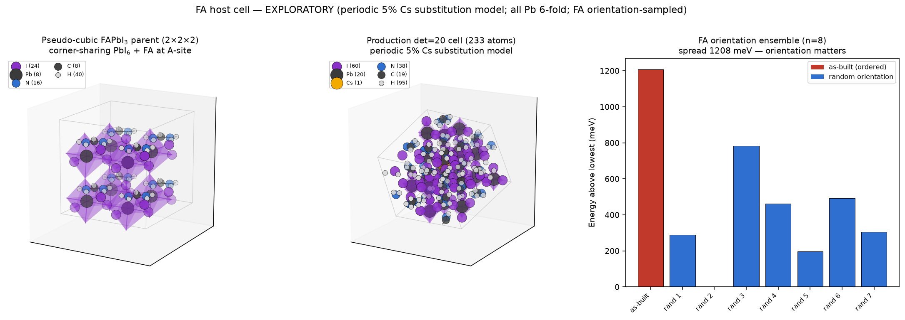
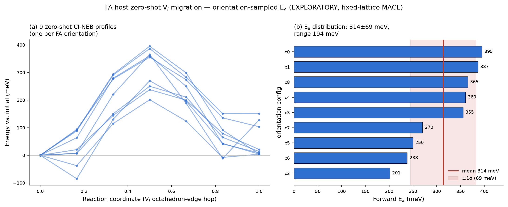

# FA host baseline — Lane 2 / W2-1 (EXPLORATORY / QUARANTINED)

> **Status tag: EXPLORATORY.** Everything here is zero-shot MACE-MP-0 structure
> building. It does **not** enter any production claim or ranking. Per
> EXECUTION_GUIDE Part 3, Lane-2 products are inputs to Stage 4 only, after a DFT
> audit. No barrier, mobility, or dynamics claim is made in this document.
>
> **Model type: this is a PERIODIC 5% Cs substitution model** of the
> FA₀.₉₅Cs₀.₀₅PbI₃ composition — one Cs on the A-site of a 20-formula-unit
> supercell, repeating through the periodic boundary. It is **not** a random alloy
> and **not** an SQS (no special-quasirandom-structure optimisation was done). The
> composition is correct; the Cs sublattice is ordered by construction.

Built 2026-07-23 by `scripts/07_fa_host_cell.py`. This document supersedes an
earlier draft that used a single FA orientation and a length-isotropy cell score;
both were corrected after structural review (see "Review responses" below).

## W2-1a — Pseudo-cubic FAPbI₃ parent

12-atom black α/pseudo-cubic parent: Pb at the origin, I at the three Pb–I–Pb edge
midpoints, one formamidinium cation FA⁺ = [CH(NH₂)₂]⁺ (CH₅N₂, 8 atoms) at the
A-site body centre. Relaxed (cell + positions) with zero-shot MACE-MP-0 medium,
float64, CPU.

| quantity | value |
|---|---|
| parent formula | CH₅I₃N₂Pb (12 atoms) |
| relaxed a, b, c (Å) | 6.519, 6.511, 6.509 |
| relaxed angles (°) | 90.0, 90.0, 88.6 |
| Pb–I coordination (min-image) | 6 (I at 3.25–3.27 Å along ±x, ±y, ±z) |
| FA integrity | C–N 1.316–1.320 Å, N–H 1.016–1.022 Å (intact) |

Relaxed a ≈ 6.51 Å is ~2.4% above the experimental cubic α-FAPbI₃ lattice constant
(a ≈ 6.36 Å; the Pm-3m room-temperature value widely reported in the literature),
consistent with MACE-MP-0 lattice over-softening — acceptable for a seeding parent.
(The 6.36 Å figure is the established experimental value; it is quoted here for scale
only and no specific paper is attributed.)

## W2-1b — det=20 supercell: full HNF sweep ranked by defect isolation

The supercell was **not** chosen by cell-vector-length alone and **not** defaulted
to 2×2×5. All 1085 index-20 sublattices (Hermite Normal Form) were enumerated and
scored by the physically correct quantity for a one-defect cell:

> **d_min = shortest periodic lattice vector = nearest-image distance = Cs–Cs
> distance = V_I–V_I distance = defect-isolation radius.**

This is what controls vacancy self-interaction; maximising it (while keeping the
cell isotropic so no single direction is short) is the goal.

| candidate | d_min (Å) | anisotropy | lengths (Å) | angles (°) |
|---|---|---|---|---|
| **chosen (optimal-fcc)** | **19.33** | **1.02** | 19.44, 19.65, 19.75 | 63.0, 116.6, 83.7 |
| best-isolation HNF | 19.43 | 1.78 | 19.6, 35.1, 26.0 | 68, 48, 30 |
| optimal-sc | 18.41 | 1.05 | 18.4, 19.3, 18.4 | 77, 119, 103 |
| naive 2×2×5 | 13.02 | 2.50 | 13.0, 13.0, 32.5 | 90, 90, 89 |
| naive 1×4×5 | 6.52 | 4.99 | 6.5, 26.0, 32.5 | 90, 90, 89 |

Transformation matrix (rows): **P = [[−2, 1, 2], [2, 1, 2], [2, 2, −1]]**.

**Why this cell:** every sublattice with higher d_min than the chosen one (max 19.43
Å, a 0.5% edge) achieves it only by stretching one axis to ~35 Å (anisotropy
1.7–3.2) — a short remaining axis that is exactly the vacancy-image-interaction
problem to avoid. The chosen fcc cell has all three vectors 19.4–19.8 Å (anisotropy
1.02) with essentially tied isolation (**Cs–Cs / V_I–V_I = 19.33 Å**). The skewed
angles (63/117/84°) are intrinsic to an fcc-type sublattice of a cubic parent and
are harmless — d_min, not the angles, sets the defect self-interaction.

## W2-1c — FA orientation ensemble (dipole-order control)

A single FA orientation imposes an artificial dipole order. We therefore build an
ensemble: FA in each of the 20 A-sites is rotated by an **independent uniform-random
rotation** (Shoemake quaternion) about its own C, and each config is relaxed
(positions, fixed cell). Result over n = 8 configs:

| config | E (eV) | ΔE above min (meV) | all Pb 6-fold | FA intact |
|---|---|---|---|---|
| as-built (ordered) | −1064.33 | **1208** | ✓ | ✓ |
| 7 random orientations | −1064.7 … −1065.5 | 0 … 780 | ✓ | ✓ |

**Ensemble energy spread ≈ 1208 meV per 20-f.u. cell = 60.4 meV/f.u.** The as-built
ordered orientation is the *highest-energy* configuration — direct confirmation that
a single ordered orientation is unacceptable. The lowest-energy config (seed 2) is
carried forward as the candidate pristine cell. Every Pb has 6 I neighbours under PBC
in all 8 configs, and every FA is intact (no dissociation).

**These are relaxed energies, not raw single-points — and the spread is not a
close-contact artifact.** The ensemble was validated on both counts the review
raised:
- **Identical protocol:** all 8 configs share the same cell (to 1e-6 Å), the same
  composition (C₁₉H₉₅CsI₆₀N₃₈Pb₂₀, 233 atoms), the same calculator (MACE-MP-0 medium
  float64), and the same convergence criterion; each was **independently relaxed**
  (positions, fixed cell) and re-checked to have max|F| < 0.05 eV/Å. So the bars are
  relaxed-energy differences of independent orientations, not single-points of
  rotated geometries.
- **No H–I clash:** the shortest intermolecular H⋯I contact in the ensemble is
  2.51–2.65 Å — the normal N–H⋯I hydrogen-bond window (a pathological clash would be
  < 2.0 Å) — and the correlation between shortest contact and energy is weak
  (Pearson r = −0.27). The spread therefore reflects genuine orientation-dependent
  hydrogen-bonding energetics, not steric artifacts.

*Caveat:* this is a static-relaxation ensemble of random *initial* orientations, not
a thermally decorrelated MD ensemble. The MD ensemble (W2-2) needs the GPU and is
deferred. What this establishes now: (i) the framework is robust across orientations
(6-fold Pb under PBC, FA intact everywhere), and (ii) orientation is energetically
first-order (60 meV/f.u.), so the Stage-4 migration matrix must sample it, not fix it.

## W2-1d — Candidate cells (exploratory)

| cell | formula | atoms | notes |
|---|---|---|---|
| pristine | C₁₉H₉₅CsI₆₀N₃₈Pb₂₀ | 233 | lowest-E orientation; all 20 Pb 6-fold |
| V_I carved | C₁₉H₉₅CsI₅₉N₃₈Pb₂₀ = **FA₁₉CsPb₂₀I₅₉** | **232** | one I removed; exactly 2 Pb become 5-fold (flanking V_I) |

`x_Cs = 1/20 = 5%`. Element-count asserts enforced in the driver and passing.

## DFT follow-ups required before this cell enters a formal calculation

1. **Vacancy charge state** — decide q = 0 vs q = +1 (and the neutral-background
   handling) explicitly, as for γ-CsPbI₃. Neutral FA₁₉CsPb₂₀I₅₉ has an odd/even
   electron count to be checked (spin scan, as in Stage 1.1).
2. **Compensating background + finite-size (FNV) correction** for the charged cell.
   d_min = 19.3 Å is large but the FNV term must still be quantified.
3. **NEB endpoint discipline** — the two migration endpoints MUST share the
   identical cell and identical atom ordering (the γ driver enforces this; the FA
   driver inherits `make_endpoints`).
4. **Cell vs fixed-lattice** — current relaxation is **fixed-lattice
   (positions-only)**, matching the DFT protocol (fixed cell, ionic relaxation). A
   `--relax-cell` flag exists for a zero-pressure model if that is preferred; the
   choice (model zero pressure vs fixed experimental lattice) should be fixed
   project-wide before Stage 4.

## Files

- `fa_parent_relaxed.extxyz` / `.cif`, `fa_parent_2x2x2.cif` — MACE-relaxed parent
- `fa19cs1_pb20i60_233.extxyz` / `.cif` — candidate pristine cell (lowest-E orientation)
- `fa19cspb20i59_232_vI.extxyz` / `.cif` — V_I cell, FA₁₉CsPb₂₀I₅₉ (232 atoms)
- `fa_ensemble_00..07.extxyz (range of 8 remote files)` — the 8 relaxed orientation configs
- `fa_host_build.json` — full record (HNF table, d_min, ensemble, asserts, coordination)
- `fa_host_structures.png` — 3-panel figure

## Review responses (2026-07-23)

All six review points were addressed:
1. **Not a random alloy/SQS** → relabelled "periodic 5% Cs substitution model".
2. **det=20 shape** → full HNF sweep + d_min metric; matrix, lengths, angles, and
   Cs–Cs distance (19.33 Å) reported above.
3. **Periodic Pb coordination** → min-image check, all 20 Pb 6-fold (2 → 5-fold on
   vacancy carve, as expected).
4. **FA orientation** → 8-config random-orientation ensemble; 1208 meV spread;
   lowest-E config used; orientation shown to be first-order.
5. **Relaxation** → parent and all supercell configs relaxed (fixed lattice;
   `--relax-cell` available).
6. **Vacancy composition** → corrected to FA₁₉CsPb₂₀I₅₉ (232 atoms); charge-state /
   background / FNV / NEB-endpoint requirements listed above.

## W2-2 — FA orientation ensemble via MLIP-MD (COMPLETE, 2026-07-24, RTX 5090)

Ran on the GPU once it returned (`scripts/08_fa_md_ensemble.py`, job `725791a1`):

- **30 ps 300 K NVT** MD on the pure-FA 2×2×2 (96-atom) parent, zero-shot MACE-MP-0
  float64 (Langevin, 1 fs, friction 0.02);
- sampled every 3 ps after 6 ps equilibration → **9 frames**, each quench-relaxed
  (fixed lattice, fmax 0.05) and structure-checked;
- **all 9 pass:** every Pb has 6 I neighbours under PBC, FA intact (C–N 1.31–1.32 Å,
  N–H 1.01–1.03 Å), N–H⋯I contacts 2.51–2.69 Å (normal H-bonds, no clash), no
  non-perovskite reconstruction;
- ensemble energy spread 196 meV across configs → genuine orientational
  decorrelation. MD used only as an orientation sampler (no kinetic claim — zero-shot
  FA rotation quality is not validated).

Files in `md_ensemble/`: `fa_orient_00..08.extxyz (range of 9 remote files)`, `results/fa_host/md_ensemble/fa_md_ensemble.json`,
`fa_md_traj_samples.extxyz.gz`, `results/fa_host/md_ensemble/fa_pure_2x2x2_96.extxyz`.

## W2-3 — zero-shot FA baseline Eₐ distribution (COMPLETE, RTX 5090)

`scripts/09_fa_neb_distribution.py`, job `119b34e5`. For each of the 9 orientation
configs, carved the **same V_I octahedron-edge hop** (I–I ~4.5 Å on the Pb nearest
the cell centre) and ran a zero-shot CI-NEB (5 intermediate images, per-image calcs,
two-stage FIRE climb, identical-ordering endpoints, fixed lattice). **9/9 converged**,
all with the saddle at image 3.

**The Eₐ distribution (the single most important Lane-2 number):**

| measure | mean | std | range |
|---|---|---|---|
| forward Eₐ | **314 meV** | 69 meV | 201–395 (spread 194) |
| backward Eₐ | 265 meV | 60 meV | — |
| symmetric (saddle vs endpoint mean) | 289 meV | 58 meV | spread 193 |

**Interpretation.** FA orientation induces a **~190 meV spread** in the migration
barrier — comparable to the barrier itself (~60% of the mean). This is the decisive
Lane-2 result: **FA orientation cannot be treated as a single value; the Stage-4/5
migration matrix must sample it.** Part of the forward spread comes from final-state
FA-environment asymmetry (3 configs have dE_endpoint > 100 meV; r(dE_end, Eₐ) = 0.56),
but even the endpoint-symmetric measure keeps a ~190 meV spread, so the orientation
effect is real regardless of the barrier definition.

**Literature sanity check (passed).** DFT V_I migration barriers in FAPbI₃ are
reported at 0.34 eV (equatorial-equatorial) and 0.45 eV (axial-equatorial), and
~0.37 eV elsewhere; experiment gives ~0.6 eV. Our zero-shot range (201–395 meV)
brackets both dominant DFT pathways (340, 450 meV fall inside the sampled range) — the
zero-shot FA baseline is in the correct physical regime. This validates carrying the
FA regression path into Stage 4/5.

Files in `neb_distribution/`: `results/fa_host/neb_distribution/fa_neb_distribution.json` (per-config + distribution +
literature check), `fa_neb_distribution.png`, `bands/fa_neb_band_00..08.extxyz.gz`.

## Lane-2 acceptance checklist (EXECUTION_GUIDE 泳道二验收)

- [x] det=20 optimal supercell selected with scoring record (HNF sweep + d_min);
- [x] ≥8 orientation configs pass structure checks (9 configs, all pass);
- [x] FA baseline Eₐ distribution reported (this document);
- [x] all files carry the EXPLORATORY tag.

**Cost:** W2-2 MD ≈30 min wall (incl. setup) + W2-3 9 NEBs ≈7 min wall on the
RTX 5090 (AutoDL), from the job dispatch/completion timestamps.
