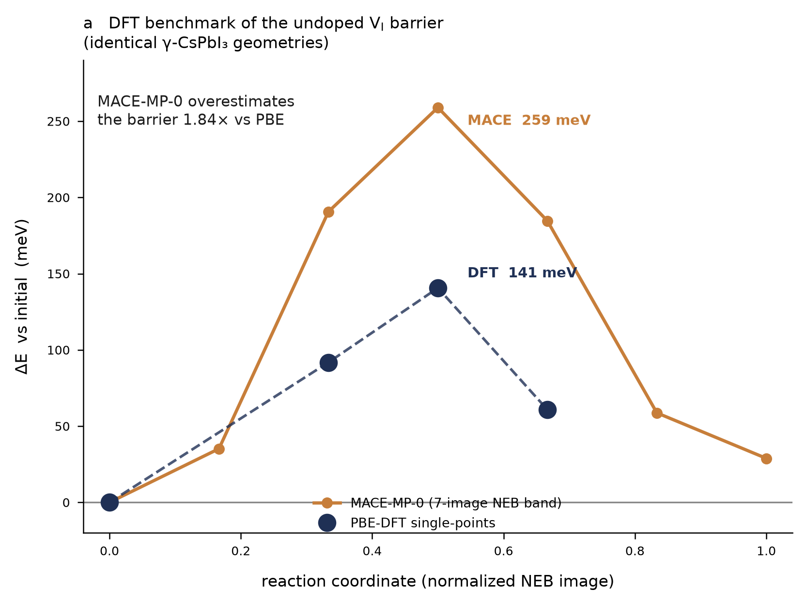

# DFT Benchmark of the MACE V_I Migration Barrier

**Anchor (a) — undoped DFT-vs-MACE barrier — DONE.
Anchor (b) — V_I⁺/V_I⁰ charge-state separation:**

```
FIXED-GEOMETRY ELECTRONIC COMPARISON:        COMPLETE
RELAXED-CHARGE-STATE MIGRATION BARRIER:      PENDING
```

The first *ab initio* check of the zero-shot MACE-MP-0 barriers used throughout
Objective 1. It answers the two methodological questions the peer review raised:
are the MACE numbers quantitatively trustworthy, and does the charge state matter?

Both anchors were computed on the **ehpc Slurm cluster** (dedicated 32-core nodes),
which replaced the contended AutoDL box. The full 8-SCF matrix (4 images × 2 charge
states) completed cleanly on one machine, so neutral and charged barriers are
mutually consistent, and the neutral energies reproduce the earlier AutoDL run to
**~6 significant decimals** (img0_q1 agrees to 6 decimals; residual differences are
at the SCF-convergence / I/O-rounding floor, ≲10⁻⁶ Ry) — well below the ~1 meV
regression tolerance, i.e. the DFT numbers are machine-independent for all practical
purposes (not literally bit-identical).



## Method

Single-point PBE-DFT total energies on the **exact MACE-relaxed NEB geometries** —
no re-relaxation, so the comparison isolates the energy model on identical structures.

| setting | value |
|---|---|
| code | Quantum ESPRESSO 7.5 |
| cluster | ehpc Slurm `comp` partition, 32 MPI ranks (`mpirun -np 32`, conda OpenMPI) |
| functional | PBE |
| pseudopotentials | pslibrary 1.0.0, ultrasoft, scalar-relativistic — Cs.pbe-spn (z=9), Pb.pbe-dn (z=14), I.pbe-n (z=7) |
| plane-wave cutoff | ecutwfc 50 Ry, ecutrho 400 Ry |
| k-points | Γ-only (159-atom 2×2×2 supercell) |
| smearing | Gaussian, 0.01 Ry |
| SCF convergence | 10⁻⁶ Ry |
| geometries | MACE-MP-0 float64 CI-NEB band (`regression_saddle_path.extxyz`), images 0/2/3/4 |
| charge states | neutral (1401 e⁻) and +1 (1400 e⁻, uniform compensating background) |

All 8 SCFs converged (30–36 iterations, ~33 min each on 32 cores). Images 2/3/4
bracket the MACE saddle (image 3); evaluating all three lets **DFT locate its own
saddle** rather than assuming it coincides with MACE's — it does, at image 3, for
both charge states.

> **Note on the charged cell.** For `tot_charge=+1`, QE adds a uniform neutralising
> background. Absolute charged-cell energies carry a cell-dependent offset and are
> **not** comparable to neutral energies. The *barrier* E_a(q) = E(saddle) − E(initial)
> is well-defined regardless, because the background term is identical at the two
> geometries (same cell, same charge) and cancels in the difference. No Freysoldt
> (FNV) correction is needed for barrier *heights* — only for absolute formation
> energies, which we do not report.

## Result — anchor (a), undoped V_I barrier

| image (reaction coord) | DFT ΔE (meV) | MACE ΔE (meV) |
|---|---|---|
| 0 (initial) | 0.0 | 0.0 |
| 2 | 91.8 | 190.6 |
| **3 (saddle)** | **140.6** | **259.0** |
| 4 | 60.8 | 184.6 |

- **DFT barrier = 141 meV. MACE-MP-0 barrier = 259 meV.**
- **The two differ by +118 meV on identical geometries** — a MODEL-LEVEL difference,
  not a MACE "error": the comparison is MACE-MP-0 (PBE+U-like, no D3, no SOC,
  zero-shot) vs QE (scalar-relativistic PBE, no U, no D3, no SOC), so neither is a
  ground-truth barrier that would let us call the other "wrong".
- **Both place the saddle at image 3** — MACE gets the mechanism and transition-state
  location right; the profile is the same shape, MACE just steeper.

The zero-shot foundation model reproduces the **mechanism** (octahedron-edge hop,
saddle position); its fixed-path barrier sits 118 meV above the selected
scalar-relativistic PBE reference. That model-level gap is the concrete reason
Objective 1's ranked ΔE_a values need a MACE model **fine-tuned to a single, consistent
theory level (PBE+D3)** rather than the zero-shot base: close enough to seed paths and
rank mechanisms, but not yet at a common level for absolute barriers.

Two caveats on the DFT reference itself:
- **PBE is not ground truth.** PBE typically *underestimates* halide-perovskite
  migration barriers (no SOC, no exact exchange, GGA delocalisation). PBE and MACE
  disagree by 118 meV at fixed geometry; neither is the converged physical barrier
  (spin state, path relaxation, SOC and finite-T effects unresolved). The gap is
  MACE-vs-PBE (two different theory levels), not MACE-vs-experiment.
- **Single-point, not DFT-relaxed.** Geometries are MACE's. This isolates the
  energy model on fixed structures — the correct test for "is the MACE energy
  surface right" — but is not a full DFT-NEB.

## Result — anchor (b), charge-state separation

| image (reaction coord) | V_I⁰ neutral ΔE (meV) | V_I⁺ charged ΔE (meV) |
|---|---|---|
| 0 (initial) | 0.0 | 0.0 |
| 2 | 91.8 | 75.0 |
| **3 (saddle)** | **140.6** | **126.6** |
| 4 | 60.8 | 63.8 |

- **V_I⁰ barrier = 141 meV. V_I⁺ barrier = 127 meV. Ratio 0.90** — the charged
  barrier is ~14 meV (10%) **lower**, with the saddle at image 3 for both.

### The critical caveat — this is *not yet* Tyagi's separation

Tyagi et al. (2025) report an **order-of-magnitude** V_I⁺/V_I⁰ separation. This
single-point result (ratio 0.90) does **not** reproduce that, and it should not be
read as contradicting it. The reason is geometric:

- These are single-points on the **same (MACE-relaxed, neutral) geometry** for both
  charge states. Removing one electron at **fixed nuclei** changes only the
  electronic energy — here a modest 10% barrier reduction.
- Tyagi's separation comes from **charged-cell geometry relaxation**: the charged
  vacancy relaxes to a *different* structure (different local distortion, different
  saddle), and it is that structural response, not the fixed-geometry electronic
  term, that produces the large separation.

So the honest status of anchor (b) is: **the charge-state DFT machinery now runs
end-to-end and gives a converged, self-consistent first number** (the single most
important previously-unvalidated link is no longer untested), **but** capturing the
Tyagi-scale separation requires a **relaxed charged path** — a charged-cell
geometry optimisation at each image, or a full charged NEB. That is the clear next
step, and it is now cheap on ehpc (~5 h for a relaxed charged endpoint pair).

This distinction matters for the project's central claim (dopants raise E_a to
suppress migration): the ranking must ultimately be done per charge state on
*relaxed* charged structures, exactly as the `CHARGE_STATE_PROTOCOL.md` fine-tuning
plan specifies.

## Reproduction

```bash
# ehpc (conda env 'qe', pseudos in $HOME/pseudo; compute nodes air-gapped, so
#  install on the login node — see compute_details for ssh:ehpc):
conda activate qe
export OMP_NUM_THREADS=1
mpirun -np 32 pw.x -in img3_q1.in > img3_q1.out     # (NOT srun — PMIx mismatch)
# barrier(q) = [E(saddle) - E(init)] * 13.605693 eV/Ry * 1000  (meV)
```

Raw energies, SCF iteration counts, electron counts, and both anchors' profiles are
in `dft_benchmark.json`.

## Files

- `dft_benchmark.png` — 2-panel: (a) undoped DFT-vs-MACE, (b) charge-state comparison
- `dft_benchmark.json` — raw QE total energies (Ry), profiles (meV), method block, both anchors, cross-cluster check
