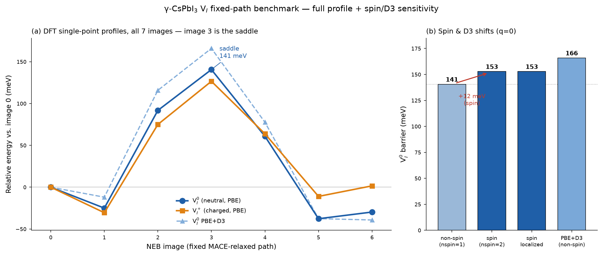

# Fixed-path DFT benchmark — γ-CsPbI₃ V_I (Stage 1.1–1.3)

**Scope.** This is the *fixed-geometry* electronic benchmark on the frozen
MACE-relaxed CI-NEB band (`results/objective1/regression_saddle_path.extxyz`,
7 images, 159-atom Cs₃₂Pb₃₂I₉₅ 2×2×2 V_I). It is **not** a DFT-relaxed migration
barrier: the geometry is the MLIP path, and DFT provides single-point energies on
it. All numbers below are single-points; no ionic or cell relaxation was done at
the DFT level. Per EXECUTION_GUIDE Part 1, the relaxed-charge-state migration
barrier remains **PENDING**.

**Method.** QE 7.5, PBE, ultrasoft pslibrary-1.0.0 scalar-relativistic
(Cs.pbe-spn z=9, Pb.pbe-dn z=14, I.pbe-n z=7), ecutwfc 50 / ecutrho 400 Ry, Γ-only,
Gaussian smearing 0.01 Ry, conv_thr 1×10⁻⁶ Ry. Run on E-HPC across 2 nodes / 64
MPI ranks (conda-OpenMPI `mpirun`; the 159-atom US cell needs ~120 GB, exceeding a
single 62 GB node). Inputs are regenerated by `scripts/05_generate_qe_inputs.py`
and parsed by `scripts/06_parse_qe_results.py`.

## 1. Reproduction gate (Stage 1.0) — PASSED

The regenerated inputs reproduce the archived benchmark to ~6 significant decimals:

| image | regenerated (Ry) | archived (Ry) | Δ (Ry) |
|---|---|---|---|
| img0_q0 | −9244.90895455 | −9244.9089544 | ~1.5×10⁻⁷ |
| img3_q0 | −9244.89861800 | −9244.89861758 | ~4.2×10⁻⁷ |

Barrier reproduced: **140.6 meV** (matches archived 140.6 meV to <0.1 meV). The
residual is at the SCF-convergence / I/O-rounding floor — physically identical, not
bit-identical. This confirms the QE generator end-to-end and that the 64-rank
(2-node) run reproduces the original 32-rank energies at this precision.

## 2. Full 7-image profile (Stage 1.3) — non-spin

All 7 images now evaluated for both charge states (benchmark had 0,2,3,4; images
1,5,6 added by job `673e904d`). Energies relative to image 0:

| image | V_I⁰ (meV) | V_I⁺ (meV) |
|---|---|---|
| 0 | 0.0 | 0.0 |
| 1 | −25.0 | −30.5 |
| 2 | +91.8 | +75.0 |
| **3** | **+140.6** | **+126.6** |
| 4 | +60.8 | +63.8 |
| 5 | −37.7 | −11.0 |
| 6 | −29.7 | +1.6 |

**Image 3 is the saddle (highest point) for both charge states** — so the
benchmark's 3-point barrier was not missing a hidden higher maximum. Images 1, 5, 6
sit *below* image 0: the NEB endpoints are metastable but not the deepest points on
the MACE path (the barrier measured from image 0 is the migration barrier of the
modeled hop; a barrier from the global minimum would be ~178 meV for q=0).

## 3. Spin scan (Stage 1.1) — the odd electron matters for q=0

The neutral cell has **1401 valence electrons (odd)** → open-shell V_I⁰. Scanned
non-spin vs spin at the two barrier-defining images:

| treatment | barrier (meV) | magnetization | note |
|---|---|---|---|
| q=0 non-spin (nspin=1) | 140.6 | — | original benchmark |
| q=0 spin, delocalized start | **152.9** | 1.0 μB | |
| q=0 spin, localized-Pb start | **152.9** | 1.0 μB | ≡ delocalized (Δ<0.01 meV) |
| q=+1 spin (nspin=2) | 126.6 | ~0 μB | closed-shell; == non-spin +1 |

**Spin raises the q=0 barrier by +12.3 meV** (140.6 → 152.9). This sits in the
10–20 meV "borderline" band the guide defined: the 141 meV value is **not
discarded** but must be reported as spin-sensitive, with both values given.

**No distinct localized polaron at PBE.** The localized-spin initial guess (Case C,
`starting_magnetization` on the two under-coordinated Pb flanking the vacancy)
relaxed to the *same* solution as the delocalized guess (Case B) at both endpoints
(Δ < 0.01 meV, absmag ~1.17–1.18 μB). At PBE the V_I⁰ odd electron gives one
spin-symmetric solution.

**q=+1 is closed-shell.** Removing the odd electron (1400 e⁻, even) collapses the
magnetization to ~0; spin polarization has nothing to act on and the +1 barrier is
unchanged (126.6 meV). So spin only matters for the neutral vacancy.

## 4. D3 dispersion (Stage 1.2)

D3(BJ) correction for PBE, computed from geometry alone (`simple-dftd3`,
charge-independent, applies identically to both charge states):

- Barrier shift: **+25.3 meV** → PBE+D3 = **165.9 meV (q=0) / 151.9 meV (q=+1)**.
- Dispersion stabilizes the initial state more than the saddle (where the migrating
  iodide is farther from its neighbours), so the barrier goes up. ~18% of the
  barrier — well above the noise floor.
- **Project-wide functional locked to PBE+D3** (per EXECUTION_GUIDE 1.2).

## 5. SOC — deferred

The pseudopotentials are scalar-relativistic (pslibrary US scalar-rel). Full
spin-orbit single-points require a separate fully-relativistic PP set and are
recorded as **SOC DEFERRED** — a Stage-2+ refinement, not part of this fixed-path
benchmark.

## 6. Combined best fixed-path estimate (q=0)

Stacking the corrections on the non-spin PBE barrier (140.6 meV): spin +12.3,
D3 +25.3. These were computed independently (spin at fixed non-spin geometry, D3 as
an additive geometric term), so the combined figure is an estimate, not a
self-consistent spin+D3 calculation:

> **V_I⁰ fixed-path barrier ≈ 141 meV (PBE, non-spin) → ~153 meV (PBE, spin) →
> ~166 meV (PBE+D3, non-spin) → ~178 meV (PBE+D3+spin, additive estimate).**

All are *fixed-geometry on the MACE path*. None is the converged physical barrier
(path relaxation at the DFT level and SOC are still open). The MACE barrier on the
same path is 259 meV; PBE and MACE disagree by ~118 meV at fixed geometry, and the
1.84× ratio is MACE-vs-PBE, not MACE-vs-experiment.

## Standing claim bans still in force

- No "reproduced Tyagi's charge-state mobility ordering" (needs relaxed charged NEB).
- No "DFT benchmarked the true migration barrier" (PBE ≠ truth; fixed path).
- "DFT found the saddle" is now allowable **only** in the fixed-path sense: image 3
  is the highest of the 7 evaluated images on the MACE path. It is not the
  DFT-relaxed saddle.

## Files

- `fixed_path_profile.png` / `.json` — the figure and consolidated 7-point profile.
- `q0_spin_scan.csv` / `q0_spin_scan_summary.json` — spin-scan table + verdict.
- `d3_check.json` — D3 per-image correction.
- `spin_scan_parsed.{json,csv}`, `all_images_parsed.{json,csv}` — raw parsed runs.
- `spin_scan_outputs/*.out.gz`, `all_images_outputs/*.out.gz` — raw QE outputs.
